### AWS Machine Learning Stack
#### Four layers
* Service
  - Amazon Polly: convert text to speech; 25 languages; 52 voices; real-time solution.
  - Amazon Lex: text/voice comprehension and response (English, Spanish); build chatbot, detect intent.
  - Amazon Rekognition: picture & video content; object, face, activity, adult content, OCR.
  - Amazon Transcribe: speech to text for call center, video subtitle, meeting note.
  - Amazon Translate: real-time or batch translation.
  - Amazon Comprehend: entity, key phrase, sentiment, insight and relationship; use case: semantic search makes search smarter.

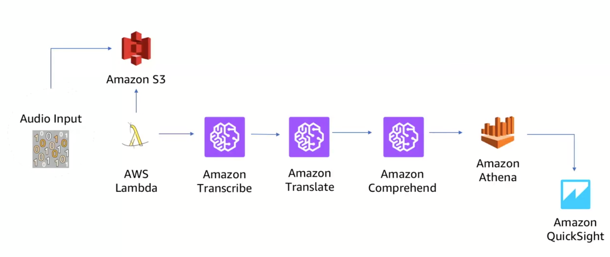

* Platform
  - SageMaker (flagship for enterprise ML):
    * Support data streaming.
    * Pre-built notebook; high performance algorithm.
    * one-click training, hypyerparameter tuning.
    * One-click deploy, hosting with auto-scaling.
  - AWS Deeplense: HD video camera with built-in CV model.
    * e.g. open garage door when seeing a car
    * Alert owner when dog sits on couch.

* Framework & Interface
  - Caffe2
  - CNTK: cognitive toolkit
  - Apache MXNet
  - PyTorch
  - TensorFlow
  - Torch
  - Keras
  - Gluon: high level DL interface.
  - Apache MXNet

* Infrastructure
  - GPU instances, CPU, IoT/Edge
  - AWS Greengrass: IoT real-time; operate offline; quick response (emergency stopping, medical call); privacy compliance.

#### Some Stats
* Data science spend 80% of time preparing data.
  - Explore data: AWS Glue, Athena
* 50% of models never get implemented.

> The value of data science relies upon operationalizing models within business applications and processes.

___
### Machine Learning for Business Challenges
Use case at Amazon
* What products to recommend at detail page.
* How many units of ASIN will be purchased next month.
* What is customer asking Alexa for.
* Is this a stolen credit card.

When to apply ML:
* When logic is not difficult to program.
* When manual process is not cost effective.
* Lots of data.
* Formalize as regression/classification tasks.

___
### AWS Core Services
#### Interface
* AWS Management Counsel
* AWS Command Line Interface
* AWS SDKs
  - Languages: JS, Python, Node, C++, PHP, Java, Go, .Net, Node.js
  - Incorporate into code.

___
#### EC2: Elastic Compute Cloud
1. Choose AMI (Amazon machine image, software selection)
2. Choose instance type (hardware selection)
3. Instance detail: number of instance, network
4. Add storage
5. Add tags
6. Security groups: firewall rule
* Create a key pair to connect over SSH.

___
#### EBS: Elastic Block Store
* Can choose HDD, SSD.
* Durable & available: duplicated automatically in same zone.
* Use **snapshot** for backup.
* Can create a volume and attach to an existing instance (same zone required)

Set up volume:
1. Choose zone.
2. Choose volume type (magnetic, SSD); size
3. Create volume and get a *Volume ID*
* Under *Volume*, click *Actions*, *Attache Volume*. Specify EC2 instance, device `dev/sdb`

```bash
# check blocks attached
lsblk

# create a file system in the volume
# xvdb is the name shown in lsblk
sudo mke2fs /dev/xvdb

# mount volume (linux)
sudo mount /dev/svdb /mnt

cd /mnt

# unmount
sudo unmount /mnt
```

Detach volume. State changes `in-use` to `available`

___
#### S3: Simple Storage Service
* Fully managed storage service.
  - Fault tolerant; replicated.
* Virtually unlimited number of objects.
* Access & retrieve data any time, from anywhere.
  - virtual private cloud end-point.
  - console, CLI, SDKs, HTTP, HTTPS
  - bucket name must be globally unique, DNS complaint, URL-safe.t
* Rich security control.
* Object is stored as key-value pair. Key resembles file path.

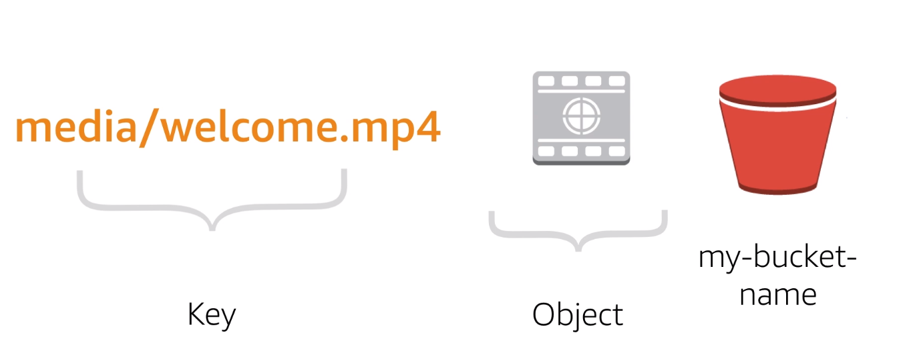

1. Create bucket: name, region.
2. Upload object from local machine (file)

```bash
# upload single file
aws s3 cp demo.txt s3://bucket-name-1/hello.txt

# sync folder
aws s3 sync src_dir s3://bucket-name-1/dst_dir
```

3. Log into EC2, which must have access to the S3 bucket.

```bash
# check content
aws s3 ls s3://bucket-name-1 --recursive

# copy file to EC2
aws s3 cp s3://bucket-name-1/hello.txt .

# sync folder
aws s3 sync s3://bucket-name-1/dst_dir ec2_dir
```

___
#### AWS Global Infrastructure
Region
* Host >= 2 availability zones.
* Organizing level for AWS services.
* Optimize for latency, cost, regulatory compliance.
* Resource in one region is not automatically replicated in another.
* All resources are not available in every region.

availability zone
* Collection of data center in a region.
* Connected via fast low-latency network.
* Independent from each other (protected from failure).

Edge Location
* CDN (Amazon Cloud Front).
* Request for content is routed to nearest edge location.

___
#### Virtual Private Cloud (VPC)
* Same concepts as on-premise networking.
* Private network in the AWS Cloud.
* What to expose to the internet, and what to remain private in VPC.
* Divide VPC into subnets
* Route tables
  - Control traffic going out of the subnets
* Internet gateway (IGW)
  - Allow access to the internet from Amazon VPC.
* NAT gateway
  - Allow private subnet resources to access internet.
* Network access control list (NACL)
  - Control access to subnets; stateless.

___
#### Security Groups
* Default: all inbound denied, outbound allowed;
* Best practice: minimum allowed
* `0.0.0.0/0` means all IP address,

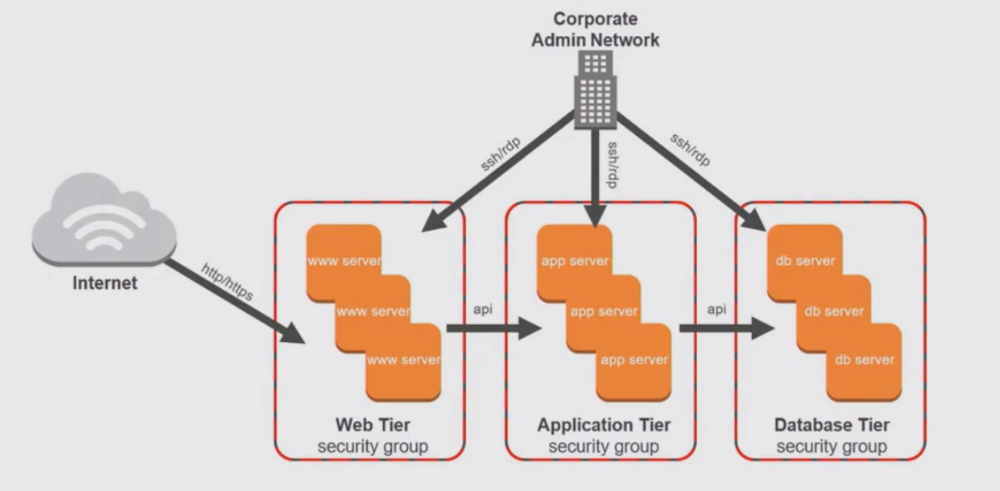


___
### Integrated Services
#### Application Load Balancer
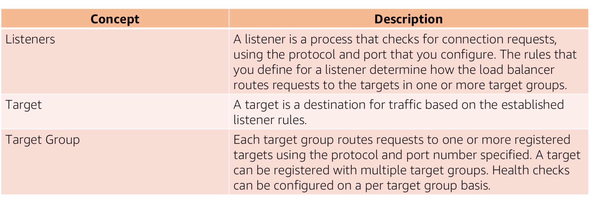

___
#### Auto-scaling
Add or remove instances.
Launch configuration
* AMI, instance group, security group, roles
Auto scaling group
* VPC, subnets, load balancer, max/min instances, desired capacity
Auto scaling policy
* Scheduled time; on-demand; scale-out scale-in.

___
#### Route 53
Translate domain name to IP address.
1. Create hosted zone.
2. Add record set `www`
3. End point: EC2, load balancer, cloud front distribution etc.
* Compliant with IPv4, IPv6

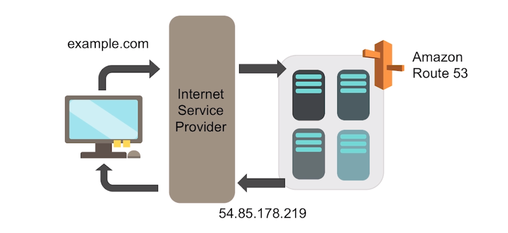

___
#### Relational Database Service (RDS)
* Building block: DB instance.
* DB engine: MySQL, Amazon Aurora, MS SQL, PostgreSQL, MariaDB, Oracle.
* DB in *private subnet*, only accessibly from EC2.
  - private subnet associated with a single availability zone.
* Automatically copied in another availability zone (**standby instance**)
  - synchronized.
  - Failover and automatically replaced

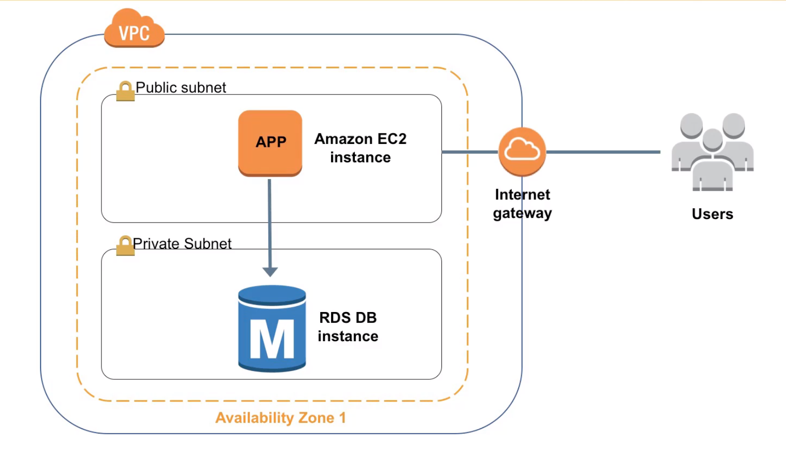
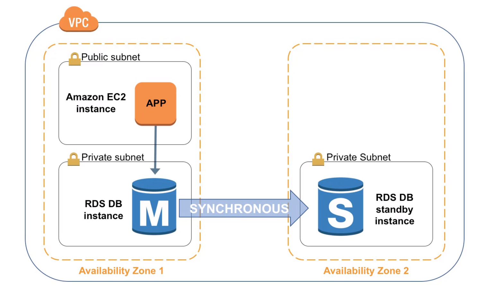

* Read replica
  - async, needs manual promotion to master
  - Reroute read query to read replica

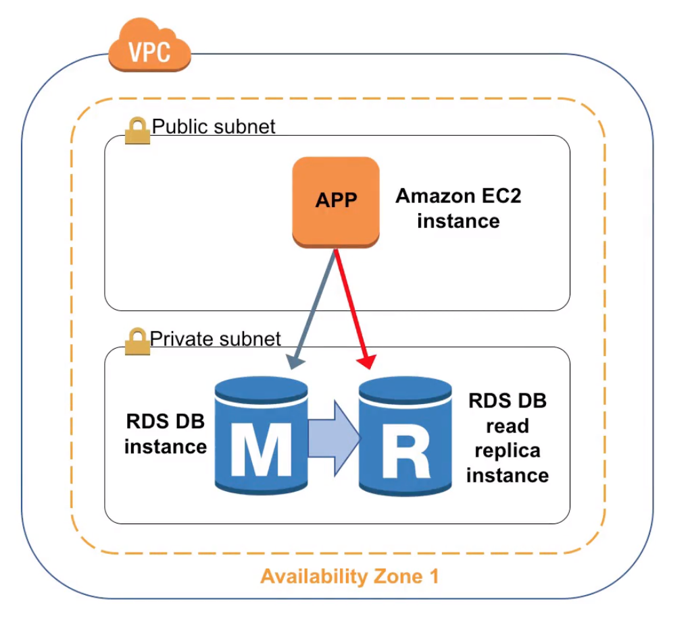

___
#### AWS Lambda
* Fully managed server-less compute.
* Event-driven execution.
* Sub-second metering.
* Constraint:
  - 5 minute
  - request, response payload 6MB
  - memory 512 MB
* Trigger:
  - CloudWatch event
* Use case: automatic backup, process upload to S3, event driven log analysis, transformation; IoT; ELT; validate user input.

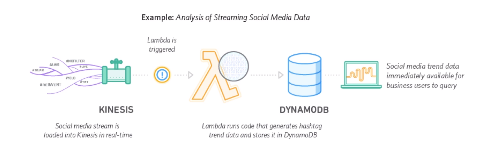

___
#### Elastic Beanstalk
Platform as a service; get application onto cloud as quickly as possible.

___
#### Simple Notification Service
* Fully managed pub/sub messaging and mobile communication services.
* Coordinate the delivery of messages to subscribing endpoints and clients.
* Edit topic policy: who can publish and subscribe
* End point: HTTP, Email, Lambda

___
#### CloudWatch
* Real-time monitoring: CPU, I/O, status check, custom check; alarm; automatically react.
* Respond to state change.
* Trigger AWS to update DNS entry when new EC2 boosts up
* Components:
  - Metric: can be customized
  - Alarm: watches a single metric; invoke one or more actions
    - stop, terminate, reboot, recover, auto-scale, SNS
  - Event: **near real time**;
  - Log: EC2 instances real-time
  - Dashboard

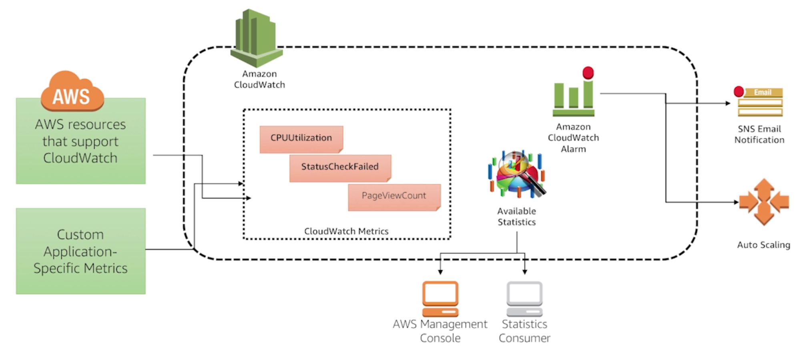

___
#### CloudFront: CDN
Cache content at edge location near users. Deliver content faster.
* Types: Web, RTMB (video streaming).
* Origin: S3 bucket, IP address of webserver, load balancer etc.
* Use case
  - static asset caching
  - live & on-demand video streaming
  - security, DDOS protection
  - dynamic & customized content
  - API acceleration
  - software distribution

___
#### CloudFormation
Simplify the task of repeatedly and predictably creating groups of related resources that power your applications.
* Automate provisioning of AWS resource.
* Template file + CloudFormation = Stack of AWS resources
* Template: yaml or JSON, describe the resource
  - contain same information as needed in AWS console manual deployment.
  - Don't need to be in same order.
  - Use `depends-on` attribute to build dependencies.
  - Automatically saved to a S3 bucket.
* Stack: Unit of deployment.
* Permission: whoever calling template must have permission to operate all resources specified in template.

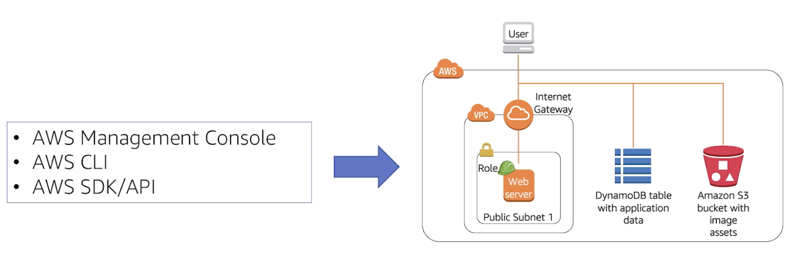
