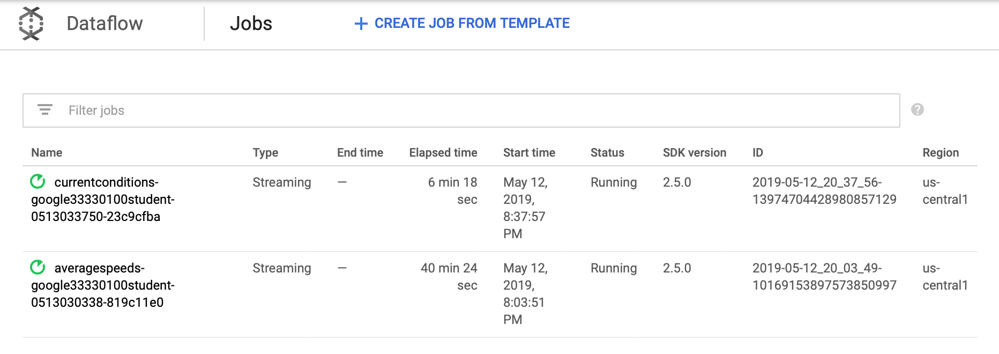

### Streaming Data Pipelines
Bugs exist with lab. Unable to complete.

#### Objectives
* Launch Dataflow and run a Dataflow job
* Understand how data elements flow through the transformations of a Dataflow pipeline
* Connect Dataflow to Pub/Sub and BigQuery
* Observe and understand how Dataflow autoscaling adjusts compute resources to process input data optimally
* Learn where to find logging information created by Dataflow
* Explore metrics and create alerts and dashboards with Stackdriver Monitoring

#### Interesting Files
* The [publish](https://github.com/shawlu95/training-data-analyst/tree/master/courses/streaming/publish) directory contains all the simulation logic.
```bash
#! /bin/bash
# User tasks:
#  1. copy repo to ~/training-data-analyst
#  2. create $DEVSHELL_PROJECT_ID
#
# Install PIP
# sudo apt-get install -y python-pip
# Use PIP to install pubsub API
# sudo pip install -U google-cloud-pubsub
# Download the data file
gsutil cp gs://cloud-training-demos/sandiego/sensor_obs2008.csv.gz ~/training-data-analyst/courses/streaming/publi$
# cd to directory
cd ~/training-data-analyst/courses/streaming/publish/
# Run sensor simulator
python ./send_sensor_data.py --speedFactor=60 --project $DEVSHELL_PROJECT_ID
```

* The `/training/project_env.sh` to create environment variables.
```bash
#! /bin/bash
# Create the DEVSHELL_PROJECT_ID on a VM
curl "http://metadata.google.internal/computeMetadata/v1/project/project-id" -H "Metadata-Flavor: Google" > Project_ID
awk '{print "export DEVSHELL_PROJECT_ID=" $0, "\n" "export BUCKET=" $0, "\n" "export JAVA_HOME=/usr/lib/jvm/java-8-openjdk-amd64/jre" }' Project_ID$
source env.txt
echo $DEVSHELL_PROJECT_ID
```

* The [run_oncloud.sh](https://github.com/shawlu95/training-data-analyst/blob/master/courses/streaming/process/sandiego/run_oncloud.sh) that runs pipeline.

* [AverageSpeeds.java](https://github.com/shawlu95/training-data-analyst/blob/master/courses/streaming/process/sandiego/src/main/java/com/google/cloud/training/dataanalyst/sandiego/AverageSpeeds.java) is passed as an argument into the `run_oncloud.sh` script.


* Run the Dataflow streaming pipeline and store result into BigQuery.
```bash
cd ~/training-data-analyst/courses/streaming/process/sandiego

./run_oncloud.sh $DEVSHELL_PROJECT_ID $BUCKET AverageSpeeds
```

* Check BigQuery table (legacy SQL).
```SQL
SELECT *
FROM [<PROJECTID>:demos.average_speeds]
ORDER BY timestamp DESC
LIMIT 100
```


* Repeat the query below to seek latest row. See that the table is updating.
```SQL
SELECT
  MAX(timestamp)
FROM
  [qwiklabs-gcp-e063ea18d24b639c:demos.average_speeds]
```

* This script is simpler in the sense that it does not do many transforms like AverageSpeeds [CurrentConditions.java](https://github.com/shawlu95/training-data-analyst/blob/master/courses/streaming/process/sandiego/src/main/java/com/google/cloud/training/dataanalyst/sandiego/CurrentConditions.java).



#### Stackdriver Monitoring
* Element Counts;
* User Counters;
* Job status: Job status (Failed, Successful), reported as an enum every 30 secs and on update.
* Elapsed time: Job elapsed time (measured in seconds), reported every 30 secs.
* System lag: Max lag across the entire pipeline, reported in seconds.
* Current vCPU count: Current # of virtual CPUs used by job and updated on value change.
* Estimated byte count: Number of bytes processed per PCollection.
* List of [metrics](https://cloud.google.com/monitoring/api/metrics_gcp).


