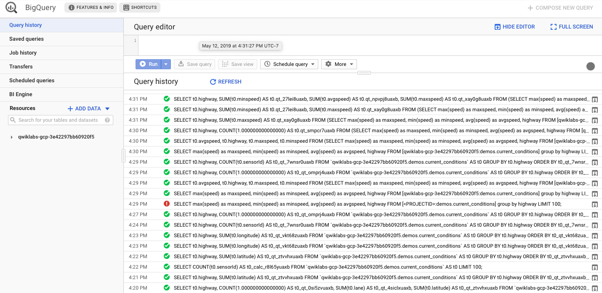

### Streaming Analytics and Dashboards
#### Objective
* Connect to a BigQuery data source
* Create reports and charts to visualize BigQuery data

#### Google Data Studio
The first step in creating a report in Data Studio is to create a data source for the report. A report may contain one or more data sources. When you create a BigQuery data source, Data Studio uses the BigQuery connector.

You must have the appropriate permissions in order to add a BigQuery data source to a Data Studio report. In addition, the permissions applied to BigQuery datasets will apply to the reports, charts, and dashboards you create in Data Studio. When a Data Studio report is shared, the report components are visible only to users who have appropriate permissions.


1. Create a calculated field `vehicle` and correct its data type: `COUNT(sensorId)`
2. Custom query issued to BigQuery:

```SQL
SELECT max(speed) as maxspeed, min(speed) as minspeed, avg(speed) as avgspeed, highway FROM [<PROJECTID>:demos.current_conditions] group by highway
```


