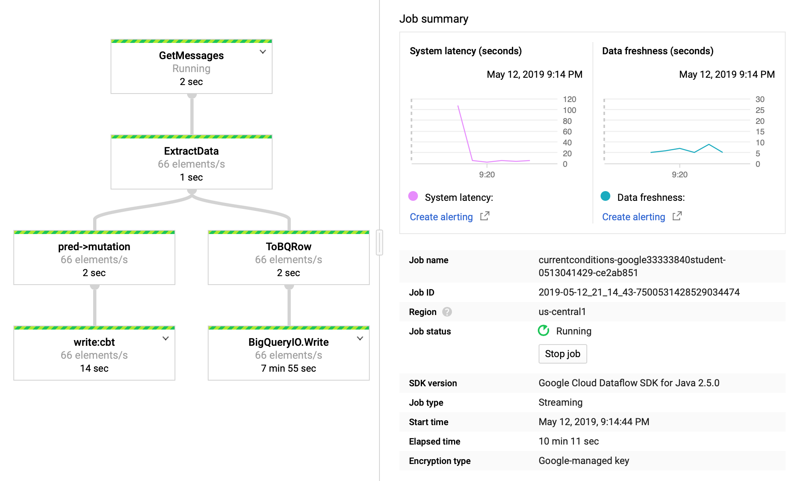

### Streaming data into Bigtable

#### Objectives
* Launch Dataflow pipeline to read from Pub/Sub and write into Bigtable
* Open an HBase shell to query the Bigtable database

#### HBase
In the training-vm SSH terminal run the script to download and unzip the quickstart [files]() (you will later use these to run the HBase shell.)
```bash
cd ~/training-data-analyst/courses/streaming/process/sandiego
./install_quickstart.sh
```

#### BigTable
Create the BigTable instance by running [create_cbt.sh](https://github.com/shawlu95/training-data-analyst/blob/master/courses/streaming/process/sandiego/create_cbt.sh).

#### DataFlow
Run DataFlow that reads from PubSub and writes to BigTable [run_oncloud.sh](https://github.com/shawlu95/training-data-analyst/blob/master/courses/streaming/process/sandiego/run_oncloud.sh).



#### Query BigTable
* Launch HBase shell [quickstart.sh](src/quickstart.sh).
* Run query in HBase:
```
hbase(main):001:0> scan 'current_conditions', {'LIMIT' => 2}
ROW                                COLUMN+CELL                                                                                       
 15#S#1#9223370811323875807        column=lane:direction, timestamp=1225530900, value=S                                              
 15#S#1#9223370811323875807        column=lane:highway, timestamp=1225530900, value=15                                               
 15#S#1#9223370811323875807        column=lane:lane, timestamp=1225530900, value=1.0                                                 
 15#S#1#9223370811323875807        column=lane:latitude, timestamp=1225530900, value=32.723248                                       
 15#S#1#9223370811323875807        column=lane:longitude, timestamp=1225530900, value=-117.115543                                    
 15#S#1#9223370811323875807        column=lane:sensorId, timestamp=1225530900, value=32.723248,-117.115543,15,S,1                    
 15#S#1#9223370811323875807        column=lane:speed, timestamp=1225530900, value=71.4                                               
 15#S#1#9223370811323875807        column=lane:timestamp, timestamp=1225530900, value=2008-11-01 09:15:00                            
 15#S#1#9223370811324175807        column=lane:direction, timestamp=1225530600, value=S                                              
 15#S#1#9223370811324175807        column=lane:highway, timestamp=1225530600, value=15                                               
 15#S#1#9223370811324175807        column=lane:lane, timestamp=1225530600, value=1.0                                                 
 15#S#1#9223370811324175807        column=lane:latitude, timestamp=1225530600, value=32.706184                                       
 15#S#1#9223370811324175807        column=lane:longitude, timestamp=1225530600, value=-117.120565                                    
 15#S#1#9223370811324175807        column=lane:sensorId, timestamp=1225530600, value=32.706184,-117.120565,15,S,1                    
 15#S#1#9223370811324175807        column=lane:speed, timestamp=1225530600, value=73.0                                               
 15#S#1#9223370811324175807        column=lane:timestamp, timestamp=1225530600, value=2008-11-01 09:10:00                            
2 row(s) in 0.7050 seconds
```

#### Housekeeping
* Run the [delete_cbt.sh]() script to delete BigTable instance.
* Select job in DataFlow console and `Stop job`.
* Stop simulator `Ctrl+C`.
* Go to the BigQuery console and delete the dataset demos.
