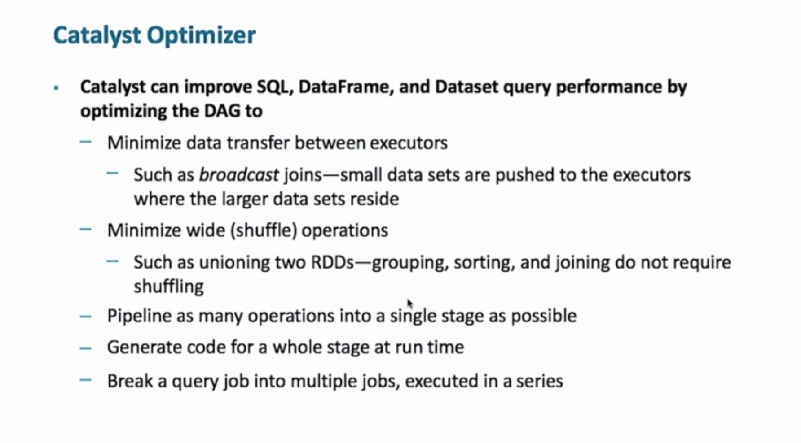
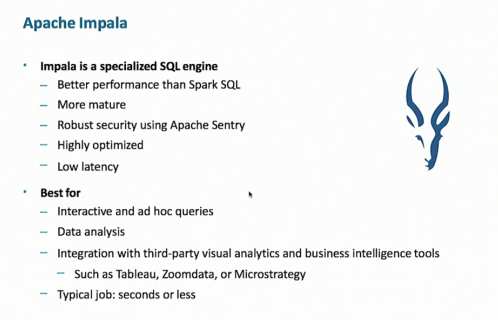
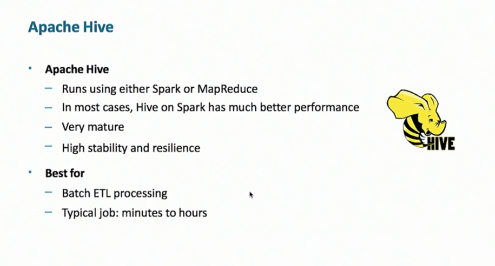
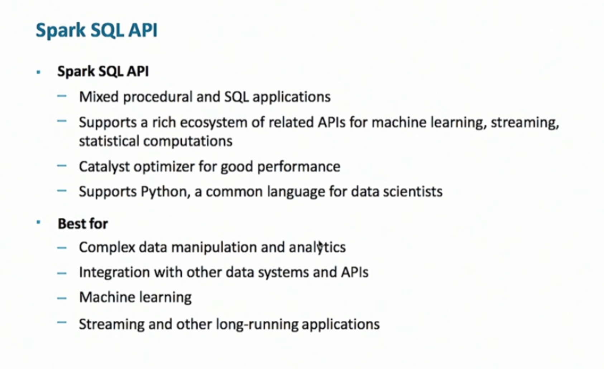
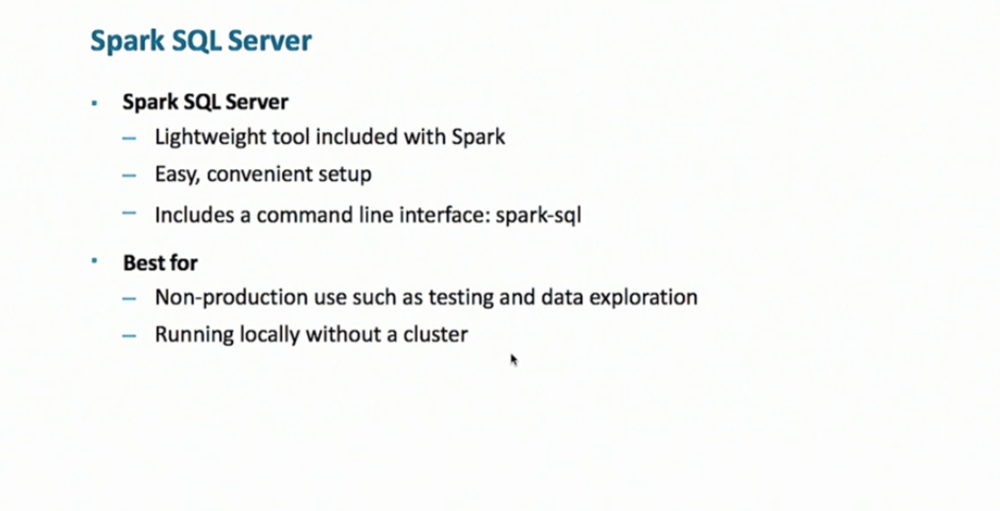

### DataFrame, Schema, Dataset
As Spark evolves, the core data structure moves from RDD to DataFrame (and Datasets): a representation of tabular data structure.
* A collection of row objects (array that keeps name and types of each field).
* Schema applies to every row in datasets.
* **Catalyst** only works for DataFrame, Dataset, not RDD.



RDD is unstructured:
* No schema defining cols and rows.
* Cannot be queried using SQL.
* Use lambda function to transform.
* Contain any types of object. Datasets contains **only rows objects, case class objects, primitives**

#### Create a DataFrame
```python
# create a DataFrame. spark.read returns a dataframe reader
df_user = spark.read.json("user.json")

# infer column name from json file
df_user.printSchema()

# equivalent to collect
df_user.show(10)

# chain actions and transformation
df_user.select("name", "age").where("age > 20").show()

# good for playing
data = [["Shaw", "Lu"], ["John", "Smith"]]
df = spark.createDataFrame(data)
data.show()

# write result: a directory with part files, one for each partition
df.write.json("mydata")

# write remote
df.write.mode("append").option("path", "/somewhere/output").saveAsTable("table")
```

#### Action
* count
* first
* take(n): returns row objects
* show(n)
* collect
* write

#### Transformation
* select: columns
* where
* orderBy
* join
* limit

#### Source Format
* CSV (properly parsed)
* Apache Parquet (very common), ORC
* Hive Datastore
* `spark.read.json(location)`, location can be
  - single file
  - list of file
  - directory
  - wildcard
  - URI, relative or absolute (use `hdfs://` not `file://`)
* convert RDD to DataFrame: pass in schema and data
* Row RDD can perform all Spark actions and transformations
* Row RDD can be converted into pair RDD

```python
# convert row RDD to RDD
rdd = rowRdd.rdd
for row in rdd.take(2):
  print(row)

# get properties from row
print(row.age)
```

#### Parquet
* supports Spark, Hadoop MapReduce, Hive, Impala
* very popularly used for DataFrame
* Columnar, not row-oriented; can read a chunk of column quickly!
* Schema is embedded, easy to transfer around;

#### Schema
* Infer from Parquet files, Hive metastore, parent DataFrame
* CSV/JSON (may be incorrect)
  - post code must not be converted to integer
  - requires file scan, takes a long time
* manual define: StructType object, with a list of StructField objects
  - each field: column name, data type, null/default
* method of DataFrame: .schema, .printSchema, .cache/persist, .dtypes, .explain
  - use `.explain(True)` to show catalyst execution plan: logical, optimized logical, physical plans

```python
# manually define schema
from pyspark.sql.types import *

columnList = [
  StructField("pcode", StringType()),
  StructField("fname", StringType()),
  StructField("lname", StringType()),
  StructField("age", IntegerType()),
]

peopleSchema = StructType(columnList)
```

___
#### DataFrame Query
* How to reference columns by string:
* column operation
  - basic arithmetic
  - comparative & logic: >, <, ||. &&
  - function: contains, like, substr
  - aggregation: count, max, min, sum, **pivot**, **agg**
    - first/last
    - countDistinct
    - appeox_count_distinct (faster)
    - stddev
    - var_sample/var_pop
    - cover_samp/covar_pop
    - corr
* Join: inner, outer, left_outer, right_outer
  - left_semi: use left table to select from right table, do not return anything from the left

```python
df.select(df.age)
df.select("age")
df.select(df.fname.startWith("A"))
df.groupBy("pcode").count()
df.groupBy("pcode").agg(functions.stddev("age"))
```

#### Spark SQL
```python
# whhen table is remote, e.g. in metastore
df = spark.sql("SELECT FROM people WHERE age <= 18;")
df.printSchema()
df.show()

# register a temp table
df.registerTempTable("df")
df2 = spark.sql("SELECT * FROM df WHERE pcode = '10075';")

# directly query file (CSV, Parquet etc), super-convenient
df3 = spark.sql("""SELECT * FROM json. `/user/shawlu/data.json` WHERE fname LIKE 'A&'""")

# create view, build up reusable layer of SQL
DataFrame.createTempView("myView") # one spark session
DataFrame.createOrReplaceTempView("myView")
DataFrame.createGlobalTempView("myView") # across session, but dies with application

# Catalog API, like SQL housekeeping API
spark.catalog.listDatabases.show()
spark.catalog.setCurrentDatabase(dbname)
spark.catalog.listTables.show()
spark.catalog.listColumns.show(table)
spark.catalog.ldropTempView(view)
```

#### Using SQL with Hive
* Apache Impala: for quick, short query (ad-hoc), seconds duration jobs



* Apache Hive running on Hadoop MapReduce or Spark; high throughput, minute-hour job.
  - a client side technology, queries are not cached



* Spark SQL API
  - best for complex manipulation, machine learning, streaming, long-running application



* SQL Server Command-line interface



___
#### Datasets
* Only in Scala, Java (require STRONG typing), not Python.
* Represent *typed, object-oriented data*, not tabular.

#### Lectures
* 20190206 Lecture 5
