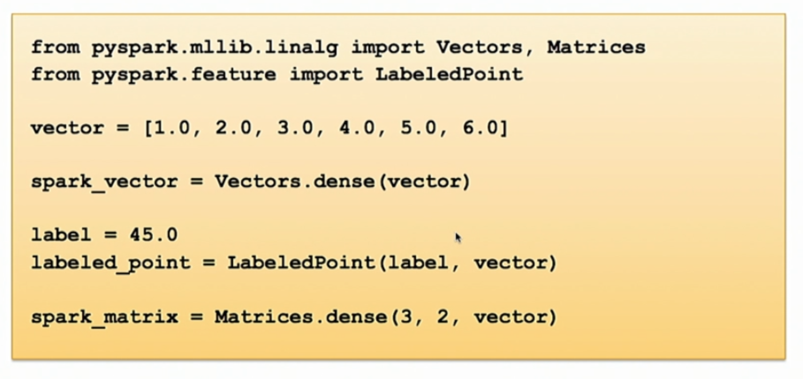
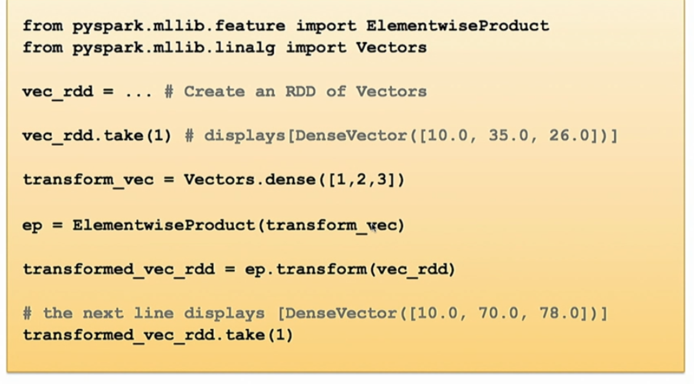
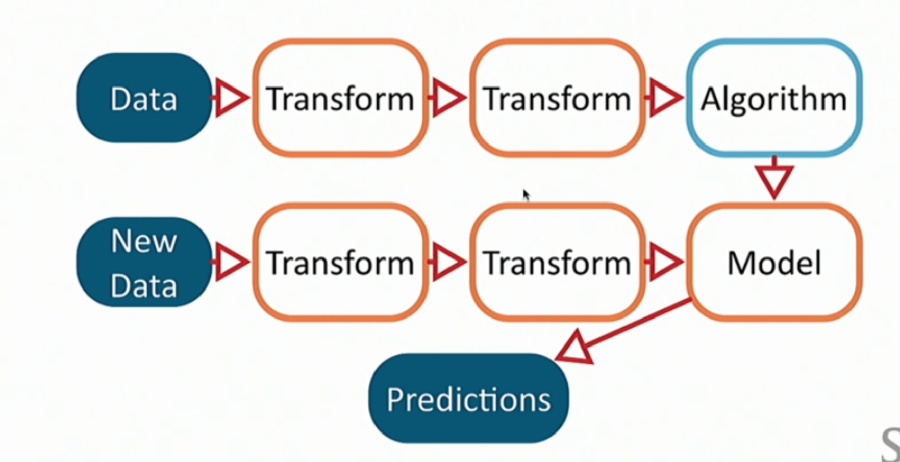
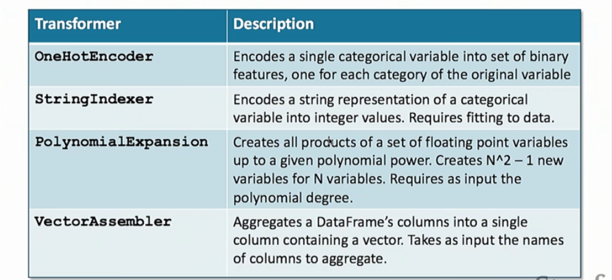

### MLlib vs SparkML
#### Tools
* `MLlib`, `ML` libraries
  - support clustering, classification, collaborative filtering.
  - `MLlib` is based on RDD
* `SparkML`
  - `SparkML` is build on top of `MLlib`, much higher level
  - `SparkML` is based on dataframe
* `mllib.linalg`
* `LabeledPoint`
* `Row`



#### `Statistics` Objects
* Input is RDD vector
* Returns `MultivariateStatisticalSummary`
* Hypothesis testing `mllib.stat.Statistics`
* Random data `mllib.random.RandomRDDs`
* Sampling built in for RDD.
* Kernel density estimation `mllib.stat.KernelDensity`

```Python
from pyspark.mllib.stat import Statistics
stats = Statistics(vec_rdd)

print(stats.mean(), stats.variance())
```

#### Feature Engineering
* `HashingTF, IDF`
* `Word2Vec`
* `StandardScaler`
  - requires **fitting** to data
  - create an instance of Standard Scaler
  * fit to produce `StandardScalerModel`
  * transform to return new RDD
* `Normalizer`
* `ChiSqSelector`
* `ElementwiseProduct`



```python
from pyspark.mllib.feature import StandardScaler
from pyspark.mllib.linalg import Vectors

vec_rdd = ...

ss = StandardScaler(withMean=True, withStd=True)

ss_model = ss.fit(vec_rdd)

scaled_vec_rdd = ss_model.transform(vec_rdd)
```

#### Dimension Reduction
* `mllib.linalg.distributed.RowMatrix`
* `computeSVD()`
* `computePrincipleComponents()`

___
### SparkML & DataFrame



* Provide higher level of clarity than RDD.
* Columnar structure is much faster.
* Standardize interface for machine learning pipeline.
* Abstractions: `DataFrame`, `Transformer`, `Estimator`, `Pipeline`
* Pipeline contains two types of task:
  - transformation: `transform` method creates another set of data
    * Has a fit method, if transformaer needs to be fitted.
    * `OneHotEncoder`, `StringIndexer`, `PolynomialExpansion`, `VectorAssembler`
  - estimator: `fit` method (required) to produce output
    * Takes DataFrame as input, produces a **model** (transformer)
    * ML algorithms are implemented as estimator.



* Pipeline estimator example: data -> [transform -> transform -> algorithm] -> model
* Pipeline model: data ->  [transform -> transform -> Model] -> prediction

```python
# pipeline example
from pyspark.ml import Pipeline
from pyspark.ml.feature import StringIndexer

df = ...

si = StringIndexer(inputCol='strings', outputCol="encoded")

pl = Pipeline(stages=[si])

plModel = pl.fit(df)

transformed = plModel.transform(df)
```

___
### Canonical Algorithms
#### Linear Regression
* Works better with `StandardScaler`
* Favorite: `mllib.regression.LinearRegressionWithSGD`
* L1 (Lasso) regularization
* L2 (ridge, Tikhonov) regularization

```python
from pyspark.mllib.linalg import Vectors
from pyspark.mllib.regression import LabeledPoint
from pyspark.mllib.regression import LinearRegressionWithSGD

lp_rdd = ...

model = LinearRegressionWithSGD.train(lp_rdd, regType="l2", regParam=0.1)

print(model.weights)

vec_rdd = ...

predictions = model.predict(vec_rdd)
```

#### Decision Tree
* Implemented in `ml.classification.DecisionTreeClassifier`
* Input must be vector. vector must contain **floating point number**
* Encode categorical variables: to be used as a transform stage before DecisionTreeClassifier

```Python
from pyspark.ml.feature import StringIndexer
catDf = ...
se = StringIndexer(inputCol="label", outputCol="label_encoded")
```

* Combining columns: vector assembler.

```Python
from pyspark.ml.feature import VectorAssembler
catDf = ...
va = VectorAssembler(inputCol=["age", "gender"], outputCol="combined")
```

#### K-means
* Estimator: `ml.clustering.KMeans`
* Need to dig into `MLlib` to control number of iterations.

```Python
from pyspark.ml impala Pipeline
from pyspark.ml.clustering import KMeans
from pyspark.ml.feature import StandardScaler

df = ...

ss = StandardScaler(inputCol="features", outputCol="scaled")
km = KMeans(k=20, featureCol="Scaled")
pl = new Pipeline(stages=[ss, km])

pred = pl.fit(df).transform(df)
```
