### Hadoop
#### 7 Network Fallacies
1. The Network is Reliable. ...
2. Latency is Zero. ...
3. Bandwidth is Infinite. ...
4. The Network is Secure. ...
5. Topology Doesn't Change. ...
6. There is One Administrator. ...
7. Transport Cost is Zero. ...
8. The Network is Homogeneous.

#### 3V of Big Data
* Volume
* Velocity
* Variety

> "Cloudera is the first Hadoop vendor."

> "We live in interesting time because we are receiving letters about the future from Google in the forms of those white papers." –– Doug Cutting

> "Nothing lets you better do with a mixed bag of stuff than Hadoop does."

> "One of the things that killed Hadoop is machine learning. Spark is worlds ahead."

___
#### Hadoop Triage
* Storage: HDFS (based on GFS)
  - Hadoop stores file in native file system (ext3, ext4, xfs).
  - HDFS may rename and reorganize files. So local file system may appear differently compared from vantage point of HDFS.
  - "modest" size files (100MB), large number (millions)
  - **data node** only see data.
    - stored on disk.
  - **name node** keeps metadata only ("what blocks store this file?")
    - two name nodes to ensure availability
      * one paradigm: one active, one standby
      * classic mode for small cluster: one name node, one helper node (secondary NameNode)
    - store on RAM
    - "small-file-problem": huge number of small files will overflow RAM
    - ask name node which data nodes store a file, Client does the assembly of blocks.
  - files are "write once": no random write to files allowed.
  - optimized for large, streaming read of files, not random reads.
  - get better **data locality**: data stored in same node as compute node.
    * typically 20% data locality at full capacity.
    * Hadoop assumes locality! Even **rack** locality.

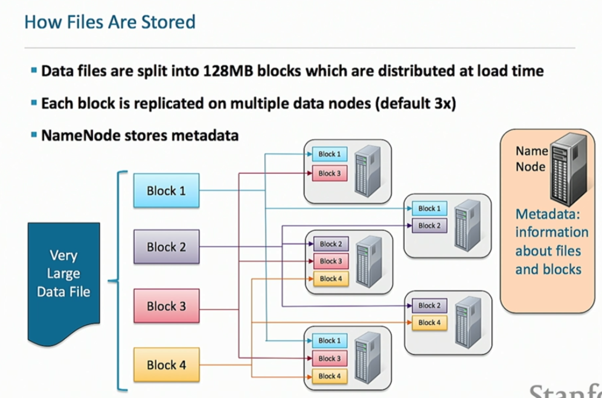

* Processing
* Resource management

#### Hadoop
* cluster: group of computers providing triage of tasks (above)
* node: an individual computer (master node, worker nodes).
* **daemon**: a program running on a node: each performs a specific function.
  - HDFS consists of three types.
  - YARN consists of two types.

#### Hadoop Ecosystem
* Scalable and economical data storage, processing and analysis.
* Distributed and fault-tolerant.
* Inspired my Google technical documents.

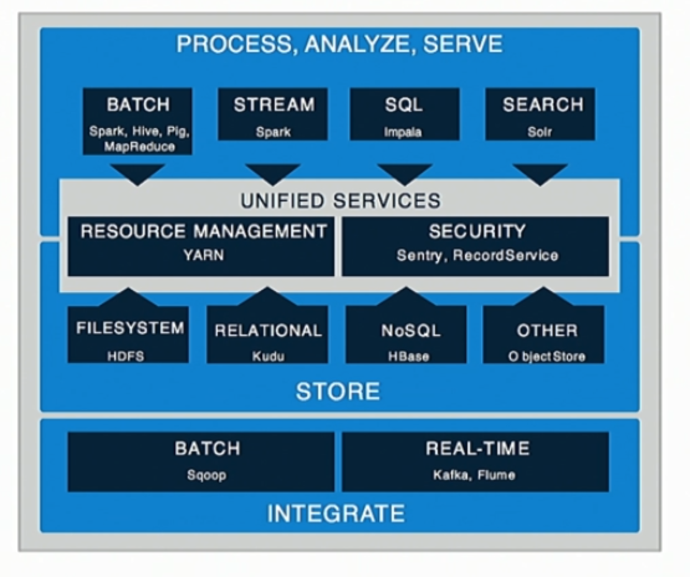

#### Ingestion
* Source:
  * databases, DBMS (Hadoop is NOT a Relational DBMS)
  * Logs, event data
  * Imported files
* Destination: HDFS, KUDU, (Apache Cassandra, sometimes)

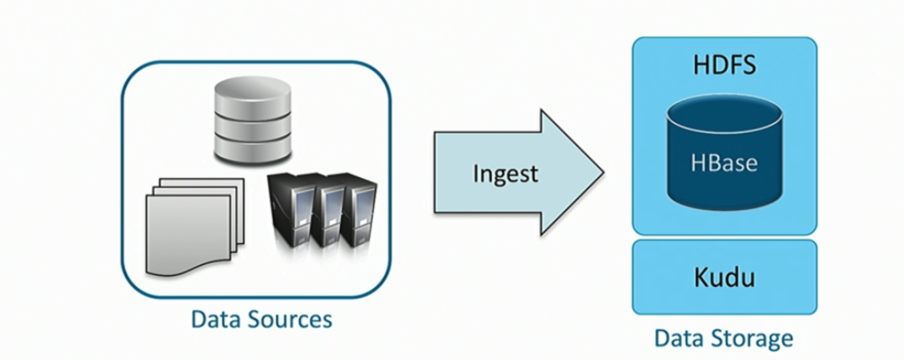

> "The two hardest problems in computer science are naming, caching, and off-byte-one error."

#### HDFS
* Main storage layer for Hadoop, but not a file system.
* An online service that lets you store data.
* No random access. Optimized for massive data store.
  - support `append`, but not used often.
* Treat directory like files.
* **GFS** works for cheapest garbage Google can buys, so does HDFS.
  - assume everything is broken.
* Accessing HDFS:
  - CML:
    * `hdfs dfs -put foo.txt foo.txt`
    * `hdfs dfs -ls`
    * `hdfs dfs -ls /`
    * `hdfs dfs -cat /user/bar.txt`
    * `hdfs dfs -get /user/bar.txt local.txt` copy to local
    * `hdfs dfs -mrdir input` create a input folder in home directory
    * `hdfs dfs -rm -r input`
  - Spark: `hdfs://nnhost:port/file...`
  - Java API: Hadoop MapReduce, Impala, Hue, Sqoop, Flume/
  - Restful interface.
* No head; tail shows last 1k of data.

___
#### YARN: Yet Another Resource Negotiator
* Reinventing the wheel. Successor to original MapReduce.
* Everything runs through YARN: Impala, Hive, Spark, Spark Streaming.
* YARN container has no meaning (unlike Docker container), just assignment of resource (memory, CPU)
  - applications run in one or more containers.
* Application Master (AM)
  - one per application. Knows how to run application.
  - run in ONE container.
  - requests more containers to run application itself.

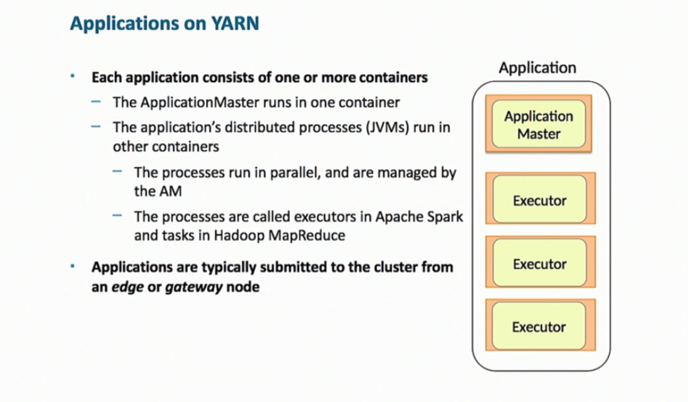

#### HBase
* Random access read-write.
* Horrible at full file scan (slow).
* Key-value store, like MongoDB.
* To insert: write-ahead-logs (not sure how it works).

#### Apache KUDU
* Pro: do random access and streaming well, and have SQL interface.
* Con: not scaling as big as HDFS.

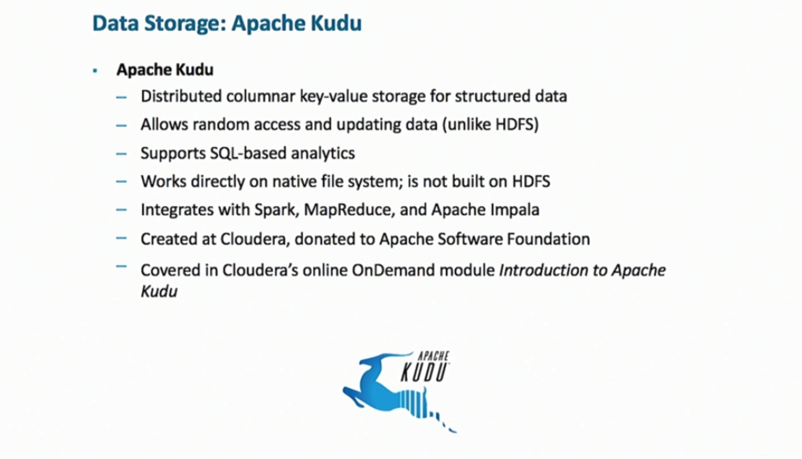

#### Ingest
* Direct transfer via HDFS
* Apache **Sqoop**: import RDBMS into HDFS
  - support Betezza, MongoDB, MySQL, Oracle, Teradata
  - Sqoop2 resolves some of the security and management issues, but no one uses it.
* Apache **Flume**: great for ingesting stream data, event data (log file)
  - moderately strong data guarantee (if machine dies, data are lost)
* Apache **Kafka**: giant distributed pub-sub.
  - Does not have connector! Just a message bus!
  - To guarantee no data loss (Kafka) and take from Apache web-server, and feed into HDFS: combine with Flume.
  - **Flafka**: strong guarantee, with connector (plugin).
* Apache **NIFI**: intended to be *user-friendly** ingest.
  - answer: who touched what, when (good for enterprise).

___
#### Apache Spark
* Founded by Matei Alexandru Zaharia (CS245), founder of Databricks
* Engine for large-scale data processing
  - general purpose
  - runs on Hadoop clusters
* A much smarter implementation of MapReduce.
* Does very well with data **caching**, great for machine learning.
* Many companies who didn't transfer from Hadoop to Spark *died*.
* Java meshes terribly with Spark.
* Scala meshes well, but gives headache (short-cut lots of boilerplate)
  - few people really understand functional paradigm.

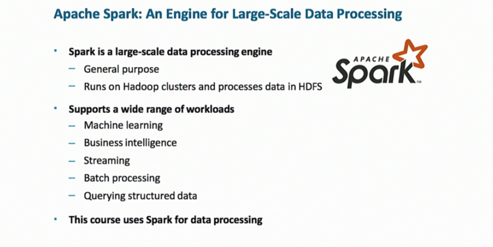

#### Apache MapReduce
* One reason why Java is still popular.

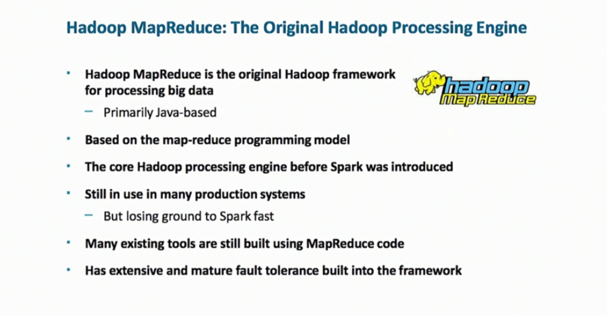

___
#### SQL
* Apache Impala: very high speed, not as scalable or resilient as HIVE.
  - SQL interface, but running against HDFS **file**.
  - can be run on delimitated text file (no need for import) with schema.
  - preferred for interactive analysis.

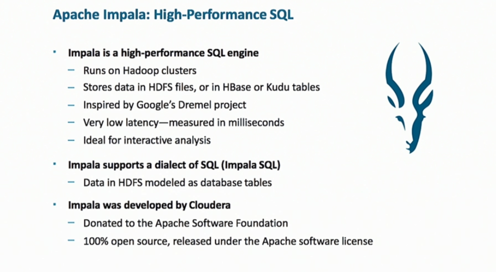

* Apache HIVE: much older.
  - Not a server, but a translator engine: SQL -> MapReduce/Spark code
  - preferred for massive throughput.
  - can run 46-day query (Impala will surely fail).

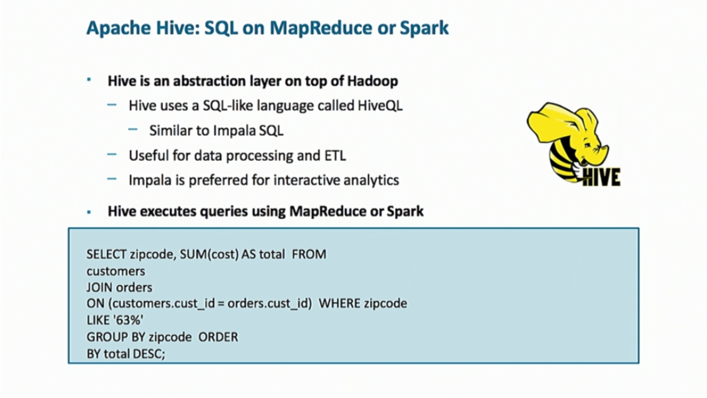

* Spark SQL

* Phoenix: built on top of HBase.

* Apache Solr: a search engine.

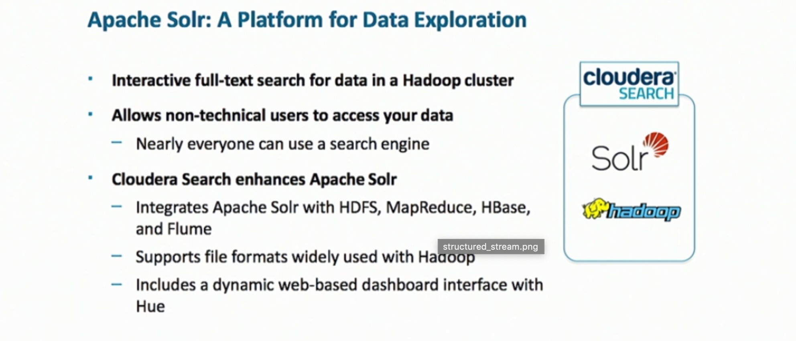

* HUE: Hadoop user interface (open-source)

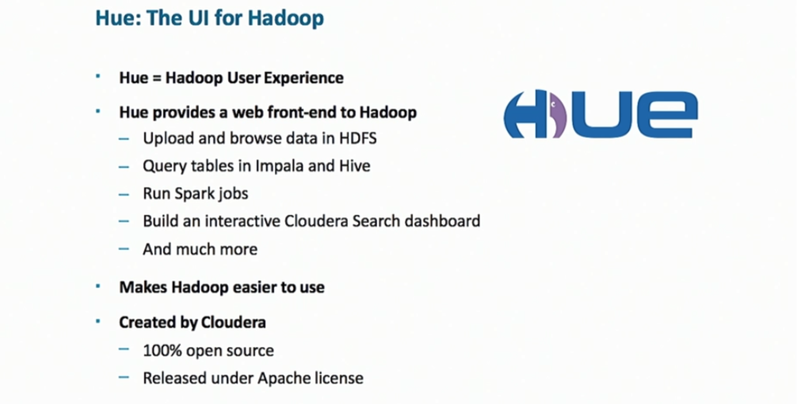

#### Apache Technologies
* Apache Ambari: a management tool
* Apache Avro: a file format
* Apache Beam: streaming processing tech by Google
* Apache Cassandra: like HBase & HDFS
* Apache DataFu: package of utilities that work with Pig and Hive.
* **Apache Flink**: streaming tech (created in Germany), intended to be Spark for streaming data.
* Apache Knox: security technology.
* Apache Parquet: data format.
* Apache Pig: died, superseded by Spark.
* Apache Ranger: security technology
* Apache Sentry: security technology
* Apache Spot: intrusion detection
* Apache Tez: alternative to MapReduce engine for Hive

___
#### Notes of CS246H Hadoop Lab:
* Lecture 2 (20190116): [mapreduce.md](mapreduce.md)
* Lecture 3 (20190123): [mapreduce.md](mapreduce.md)
* Lecture 4 (20190130): [spark.md](spark.md)
* Lecture 5 (20190206): [dataframe.md](dataframe.md)
* Lecture 6 (20190213): [stream.md](stream.md)
* Lecture 7 (20190220): [ml.md](ml.md)
* Lecture 8 (20190227): [sql.md](sql.md)
* Lecture 9 (20190306): [sql.md](sql.md)
