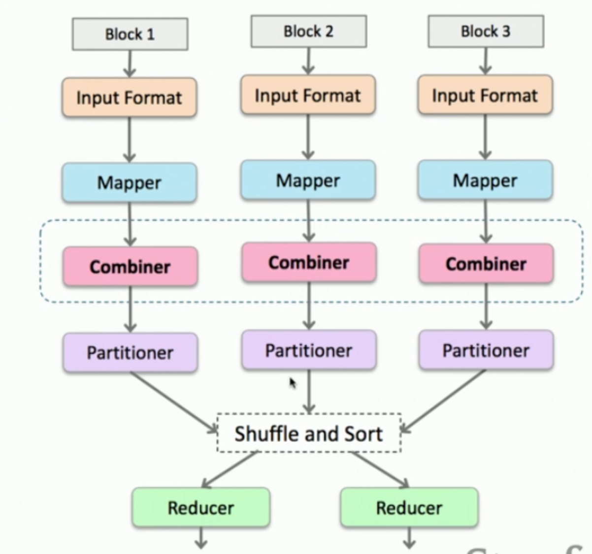

#### Workflow
1. Mapper
  - default key is byte offset of that line in the file
  - can have multiple inputs path

2. Combiner
  * Mini-reducer, precursor, that runs on a single mapper's output.
  * Its output is sent to reducers (e.g. does sum *locally* for the output).
  * When reduce function is **commutative & associative**: combiner and reducer are identical (types match of course).
  * May run multiple times, do not affect results that depend on how many times it runs.

```Java
job.setCombinerClass(IntSumReducer.class);
```



3. Shuffle (Partition) and sort

4. Partitioner
* Takes a key and maps to a partition. Which reducer each intermediate key and its list of values go to.
* Input: key, value, number of reducers
* Default: `HashPartitioner`
* return: 0 ~ number of reducer - 1
* Need custom to deal with **secondary sort** and workload **skew**.

```Java
job.setPartitionerClass(Partitioner.class);
```

5. Reducer:
  - when see a key, it sees **all** values for that keys
  - **keys** are in sorted order
6. output: key`<tab>`value
  - output directory contains `part` files (no control over its name).
  - cannot use a directory that already exists.
  - each part file is from a reducer (not a node! a node can have many reducer)

#### Terminology
* job: a full programs, all map and reduce tasks.
* task: execution of a single mapper or reducer on a slice of data.
  - at least as many task attempts as number of tasks.
  - may schedule more attempts than needed.
* block: precise size chunk of data (typically 256MB)
* split: input to a single mapper
* partitioner: hashes key to decide which reducer to send.
* driver: a java programs that configures and submits the job.
  - Annotated driver code example: [word_count.java](word_count.java)

```Java
public class WordCount {
  public static void main(String[] args) throws Exception {
    if (args.length != 2) {
      Systems.out.printf("Usage: WordCount <input dir> <output dir>\n");
      Systems.exit(-1);
    }

    Job job = Job.getInstance();
    job.setJarByClass(WordCount.class); // let slaves know the job
    job.setJobName("Word Count"); // any thing

    FileInputFormat.setInputPaths(job, new Path(args[0]));
    FileOutputFormat.setOutputPaths(job, new Path(args[1]));

    job.setMapperClass(WordMapper.class);
    job.setReducerClass(SumReducer.class);

    // set mapper's output format
    // job.setMapOutputKeyClass(Text.class);
    // job.setMapOutputValueClass(IntWritable.class);

    // set reducer's output format
    // actually set for BOTH mapper and reducer!
    job.setOutputKeyClass(Text.class);
    job.setOutputValueClass(IntWritable.class);

    // block until job completes (synchronous)
    boolean success = job.waitForCompletion(true);

    // alternatively, ASYNCHRONOUS
    // job.submit()

    Systems.exit(success? 0 : 1);
  }
}
```

#### Concepts
* key and values are Java objects, not primitives
  - key: `WritableComparable`, needs to be sorted.
  - value: `Writable`
* **Path**: Hadoop equivalent of a file.
* Default: `IdentityMapper`, `IdentityReducer`
  - IdentityMapper is often used! Because map-reduce must occur in pair.
* ToolRunner: use flag `-D`
  - arguments must come BEFORE any other program arguments
  - overwrites config
  - does not overwrite driver code properties
* `overwrite`: if type signature does not match, and overwrite is left out, IdentityMapper is used!
* `public void setup(Context context)`: before mapper and reducer get started
* `public void cleanup(Context context) throws IOException, InterruptedException`
* Map-Only job: image processing, file format conversion, **ETL**.
  - must set reducer to zero: `job.setNumReduceTasks(0);`
  - call the setOutput...Class, not setMapOutput...Class
  - but does not have to be WritableComparable
* Single reducer: globally sorted order, see all values; keys are sorted (consecutive)
* Fixed number of reducer jobs: 12 months of a year.
* Trade-off:
  - more reducers mean faster job processing.
  - multiple "waves" (epoch), last epoch has most nodes idle.
