### SQL Tools
* Hive
* Impala
* Presto (like Impala)
* Phoenix

#### Hive
* Hive SQL, close to SQL. (Hive is not a database)
* Translate SQL to MapReduce/Spark/Tez/LOAP (4 flavors) jobs.
* Hive is a top layer that translates.
  - parse HiveQL.
  - Optimize.
  - Plan execution.
  - Submit to cluster.
  - Monitor progress.

#### Impala
* An actual database server.
* Very, very fast query (milliseconds).
* End-to-end continuity: HDFS, HBase tables, Kudu, S3
  - parse HiveQL.
  - Optimize.
  - Plan execution.
  - Submit to cluster.
  - Monitor progress.
* Impala executes plan on Hadoop cluster.
* Does not have its metadata store. Use Hive's metadata store.
* Doesn't scale beyond a few hundred nodes (Hive scales to 8,000 nodes).

> Many business intelligence tools support Hive and Impala (e.g. Tableu, excel for grownups).

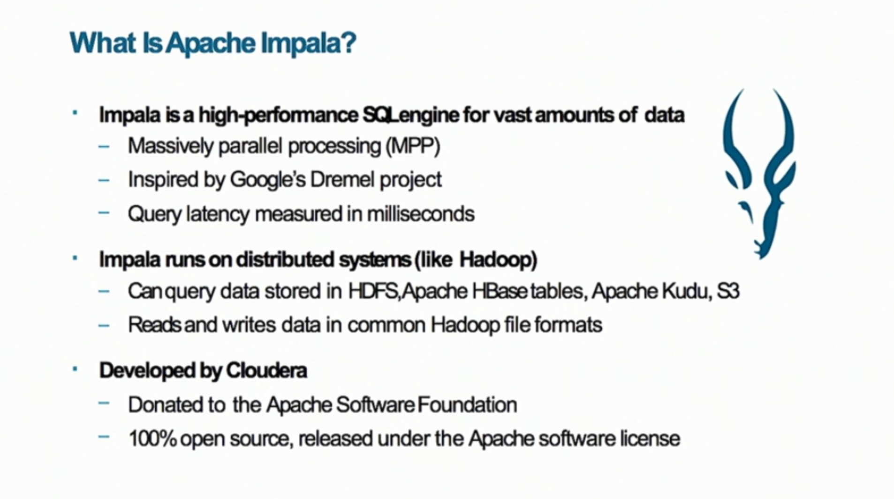

___
#### Common between Impala & Hive
* Support UDF (user-defined functions).
  - if too many UDF, use Spark instead.
* Speak SQL 92.
* Share same data warehouse & metadata storage.
  - *Both separate metadata from data.*
  - metadata are stored in database (e.g. MySQL).
  - Typical ingest: *schema-on-write*.
  - Hive & Impala: *schema-on-read*.
    * Create metadata to represent table. Underlying data don't change.
* Often used together.

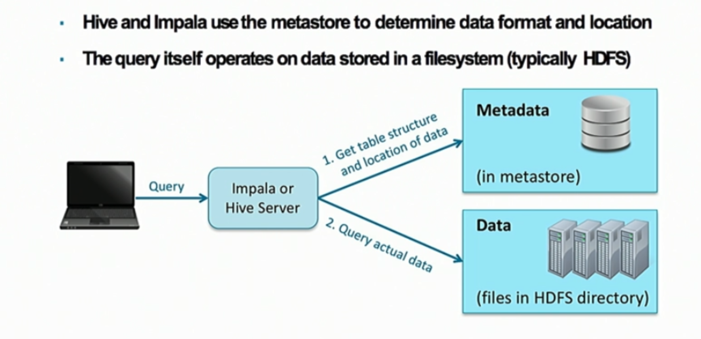

#### Compare to DBMS
* Databases are
 - great for transactional queries. Hadoop is not replacement.
 - very fast response time.
 - allow updating existing records.
 - Serve thousands of simultaneous clients.
- Hive & Impala:
  * no support updating & deletion;
  * no transaction;
  * no referential integrity.

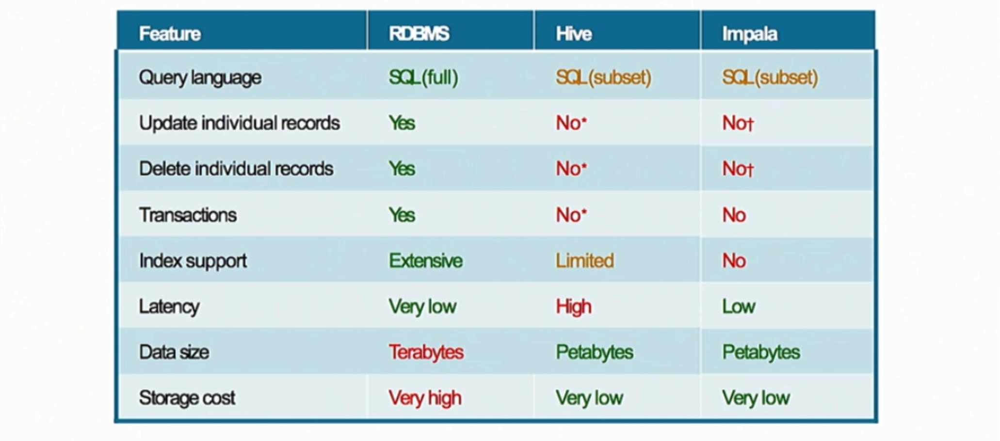

#### Fault Tolerance
* Hive takes advantage of MapReduce/Spark fault tolerance.
* Impala: single node fail, query fails. Must run again.

___
#### Table
* Maps to a directory.
* A directory can contains multiple files.
* Cannot have sub-directories.
* Data are meaningless. Context is given by metastore.
* A table belongs to a database.
  - Hive & Impala support multiple databases.

```SQL
USE accounting;
SHOW tables;

SHOW tables IN sales;

DESCRIBE orders;

-- more details
DESCRIBE FORMATTED orders;
```

#### Syntax
* Keyword: SELECT, FROM, WHERE, AS (not case sensitive).
* semicolon terminated;
* Impala support c-style block comment.
* `*` selects all columns.
* De-duplicate: `DISTINCT` keyword.
* **identifier** identifies table, column.
  - avoid keyword clashes, use quoted identifier:
  ```
  SELECT `select` from ...
  ```
* Sort: Impala does not require sorted column in SELECT. Hive does.
* Single equal for equality.
* Table alias: `AS` (optional).
* Logical: `AND`, `OR`, `In`.
* Hive & Impala support subqueries in `FROM` & `WHERE` clause (must be named).

| Header One     | Uncorrelated   | Correlated     | Scalar         |
| :------------- | :------------- | :------------- | :------------- |
| Hive           | Yes            | Limited        | No(C6.0)       |
| Impala         | Yes            | Yes            | Yes            |

#### Datatypes
* Hive does forceful conversion. Impala requires strict typing.
* Out of range: Hive returns NULL. Impala returns maximum/minimum.
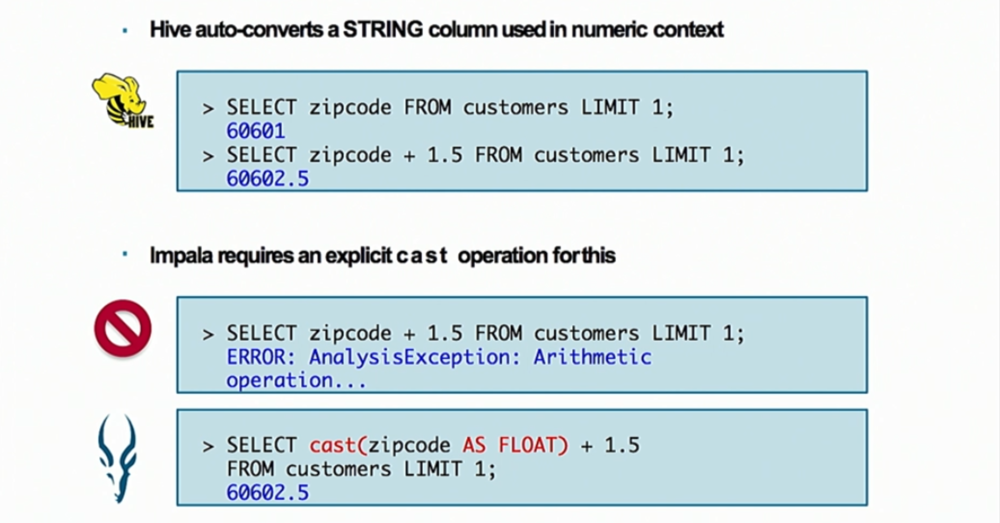

#### Interface
* HUE web UI: Hive query editor; Impala query editor; metastore manager.

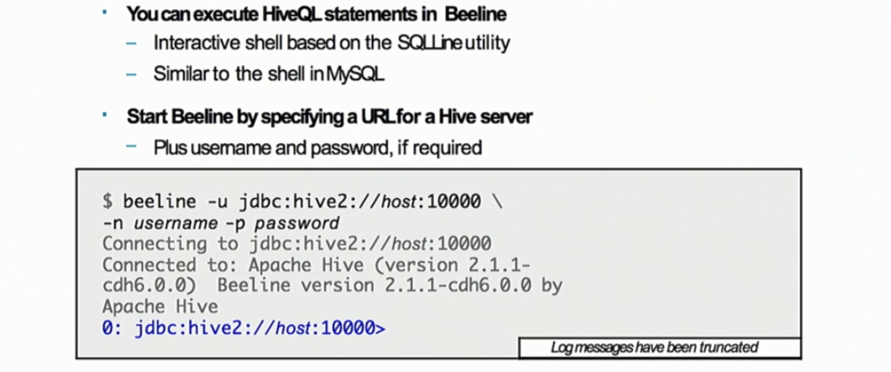

* Command-line shell: beeline shell (written in Java), impala shell (written in C).

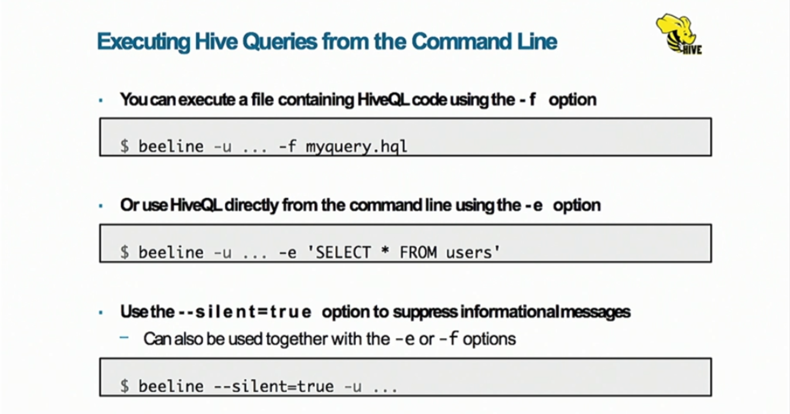

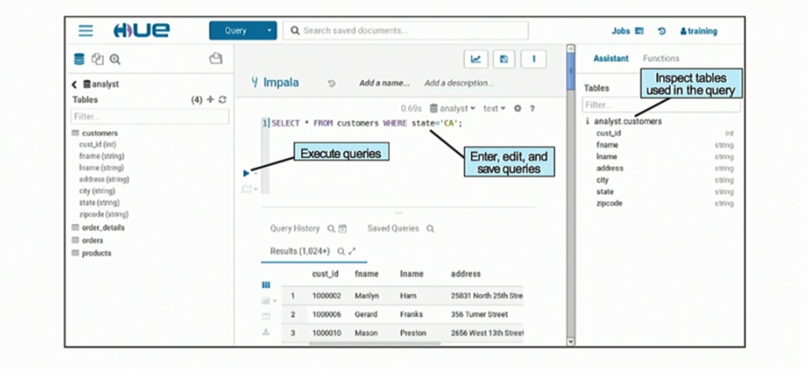

``` bash
# execute file
$ impala-shell -f myquery.sql

# run query
$ impala-shell -q "SELECT * FROM users"

# use --quiet to suppress information
$ impala-shell --quiet -f myquery.sql

# use -o to output to file, optional set delimiter
$ impala-shell -f myquery.sql --delimited --output_delimiter="," -o results.txt
```


* ODBC/JDBC.

#### Common Operation & Functions
* Insert operator between columns (`SELECT first - last FROM ...`).
* Null
  - `IS NULL`
  - `IS NOT NULL`
* `COUNT(*)` returns number of rows; `COUNT(col)` counts non-null.
*

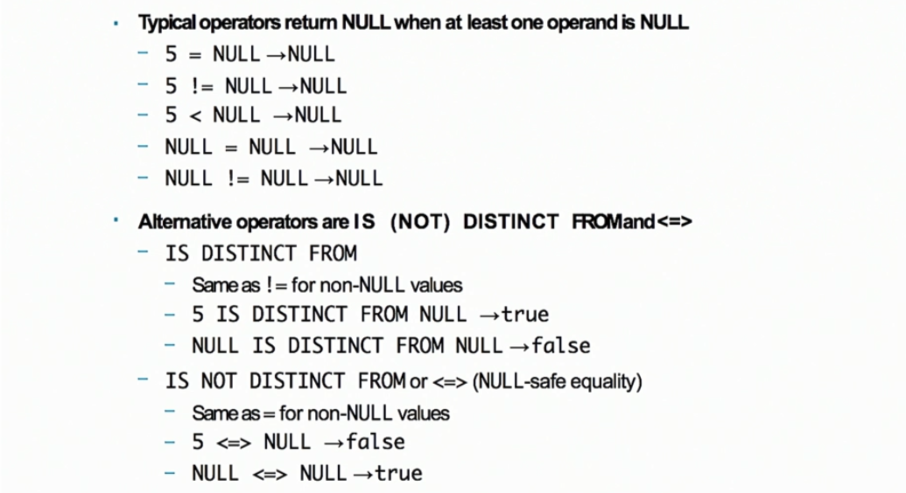

* Columns can have alias
* Tons of built-in functions. Function names case-insensitive.
  - `concat(fname, " ", lname)`
  - arguments can be columns, literal values, expressions.
  - named lowercase.

#### Metadata
* Impala caches metadata. Hive does not.
* If Hive makes update to HDFS, Impala metadata is out of sync.
  - needs to refresh Impala.
  - refresh all metadata is expensive.
* Hive & Impala can access metastore with built-in utility. Spark doesn't have.
  - Hive has **HCatalog** that access metastore via CML.

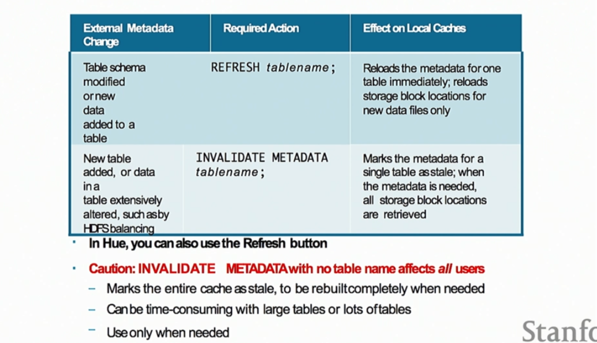

#### Manage Tables
* Can set location (absolute path, complete URI (`S3`, `adl`))
* Can externally create table.

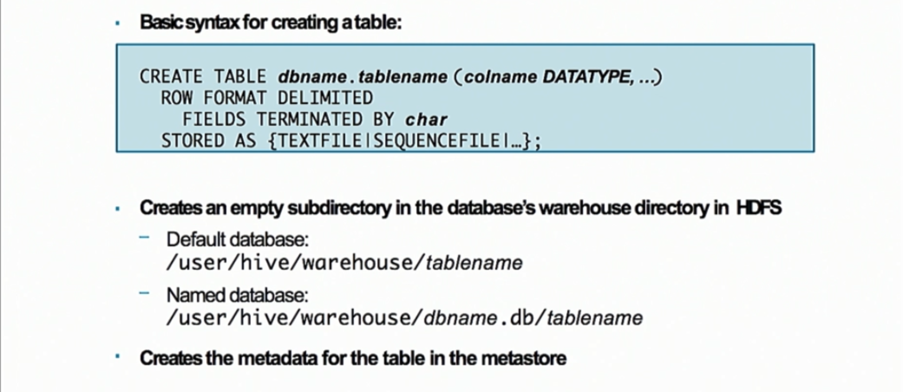

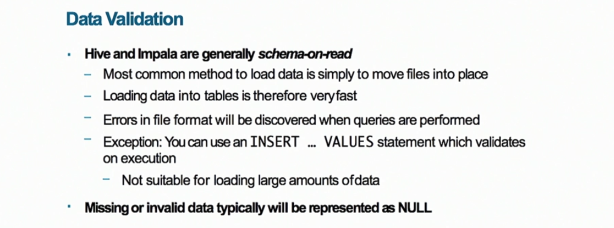

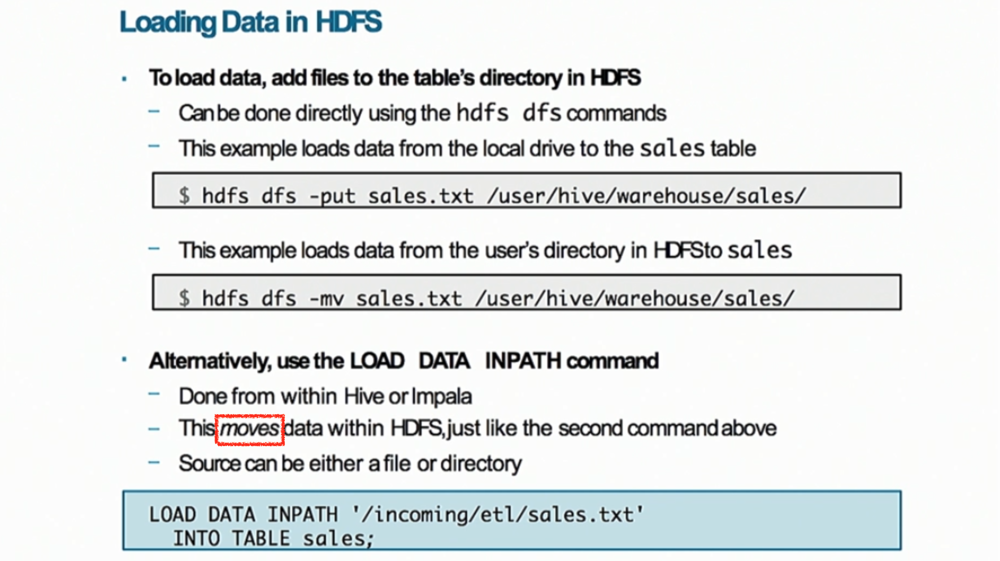

* Removing database (1:23:32)
* Rename and modify table (1:25:22)
* Reorder column (1:25:36)
* Add/remove column (1:25:45)
* Replace column (1:25:47)
* Change other properties (1:26:30)
* Create view (1:27:15)
* Save query results into a table (1:29:25)
* Create table ... AS SELECT (1:29:50)
  - schema inferred from query (alias overwrites column names).
* Can write output to a directory (1:30:40)

#### Partitioning
* Not available in traditional SQL.
* All files in a directory are data for **one** table.
  - all files scanned for every query.
* If all you need is to query by customer ID, put customer with same ID in same partition.
  - each partition has a subdirectory.
  - partitioned column becomes a virtual column, not represented in data (saved as dir names)
  - can have nested partitions (risk creating too many partitions)
* static partition: deliberate choice, annoying. (1:36:08)
  - insert new partition: (1) add to metadata (2) create dir (3) moves to dir.
* dynamic partitioning: can screw up everything. (1:37:58)
  - partitioned column must come in the end of SELECT.
* When to partition:
  - read entire dataset takes too long.
    * full scan, throw aways most.
    * When cluster is large, most data are remote (taking over network).
    * Partitioning throws away less.
  - query always use the partitioned column.
  - small cardinality for partitioned column.
    * *small-file-problems*.
    * Running out of memory for name node.
    * May accidentally happens with dynamic partitioning.

#### Format
* Avoid txt file! (super-inter-operable, human readable, but slow and ugly)
  - representing number as string waste space.
  - difficult to represent binary data such as images.
  - conversion back/forth to native format takes time.
* SequenceFile:
  - first replacement of txt file.
  - very fast, but poor interoperability. Avoid!
* **Avro**:
  - evolvable; binary encoded; **row-based** (add a column later).
  - Created by Doug Cutting.
  - Good for long-term design.
  - great performance and interoperability.
  - Embed schema in file itself: `CREATE TABLE ... STORED AS AVRO;`
* Columnar file format:
  - RCFile (bad), ORCFile (improved, gaining traction).
  - **Parquet**: comparable to ORCFile. `CREATE TABLE ... STORED AS PARQUET;`
* Consider:
  - Ingest pattern (row vs. columnar);
  - Tool compatibility;
  - Expected lifetime;
  - Storage and performance requirement;

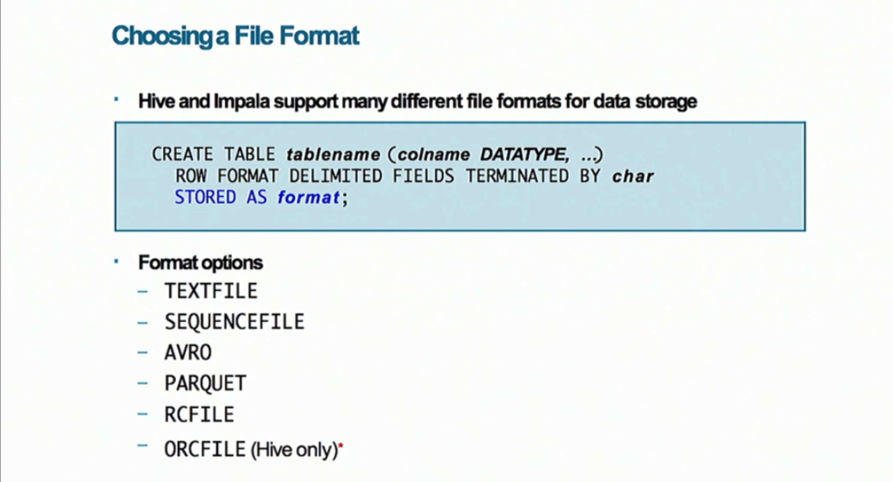
