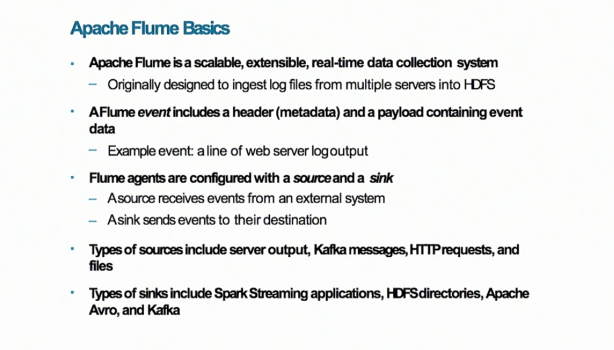
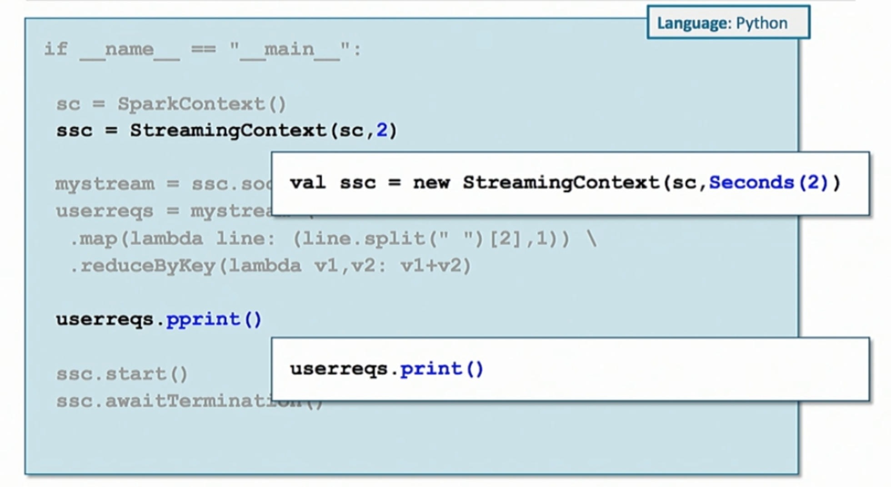
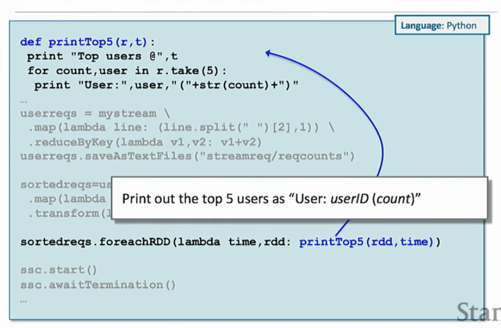
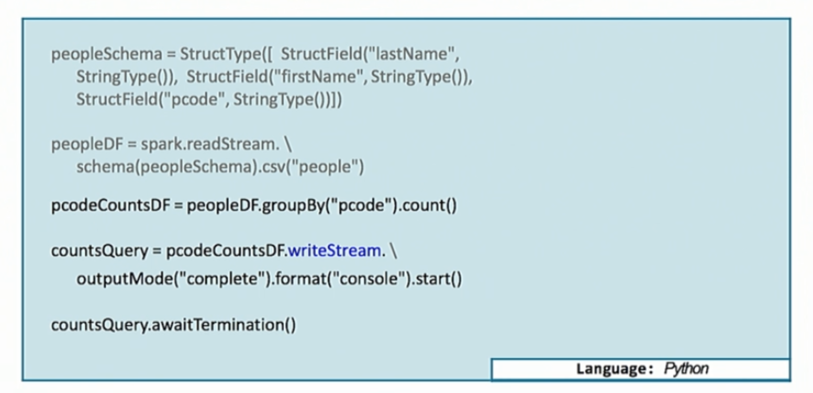
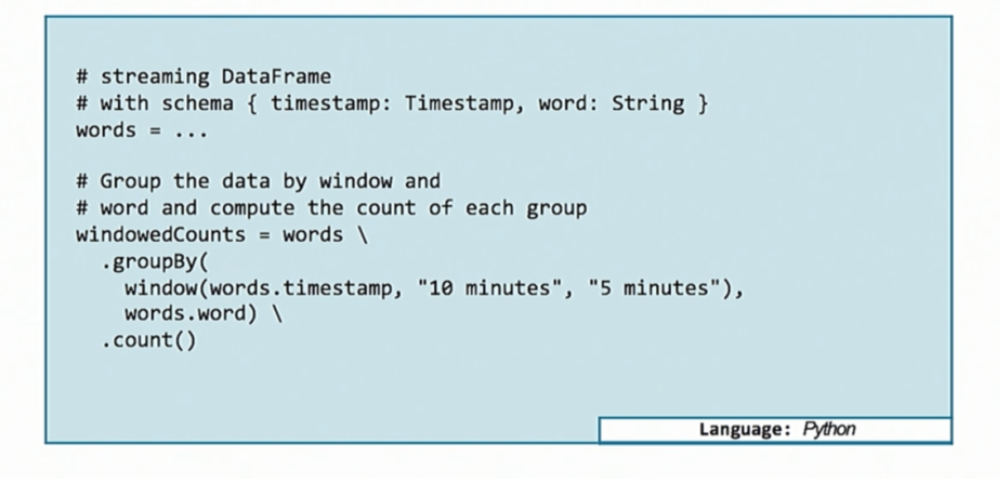
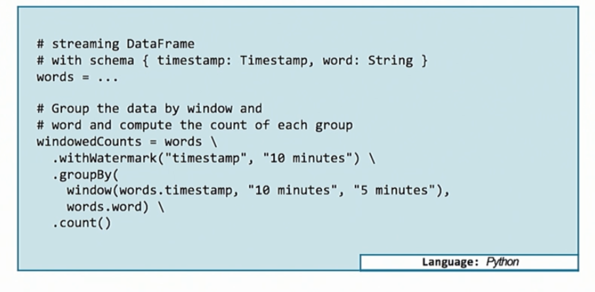

### Spark Streaming
Not actually streaming. Instead, processing **micro-batch**.
* Extension of core Spark.
* Real-time data processing.
* Scalable, efficient fault tolerant.
* "once and only once" processing.
* Use core Spark APIs.

#### Use Case
* Fraud detection.
* Continuous ETL.
* Website monitoring.
* Trading.
* Ad monetization.
* Social media analytics.

#### DStream:
Container of RDD within n seconds
- Discretized stream
- Monitor network socket: `stream = ssc.socketTextStream(hostname, port)`
  - service: Flume, Kafka, Twitter, Amazon Kinesis
- Monitor new content in HDFS directory: `stream = ssc.textFileStream(path)`
  - pass in directory, look for new files added (least useful)
- operations are executed once per duration.
- transformation: return a new DStream
  - map, flatMap, filter, reduceByKey, groupByKey, join
  - `transform(function)`, applies transformation to every RDD in the DStream
- Must tell Spark to remember previous window. Otherwise it's actively removed.
  - **slice**: operate on collection of batches
  - **state**: cumulative operations
  - **window**: aggregate across sliding time period.

```python
# de-duplicate within a time window
distinctDs = myDS.transform(lambda rdd: rdd.distinct())
```

#### Data Source
* Most data sources are based on receivers.
* Receiver buffers incoming data locally **until** processed
  - can blow up receiver if processing is slow.
* DStream reads from receiver.

#### Flume
Designed to be declarative, fan-out architecture.



* receives data from source, and sends to sinks.
* source -> channel -> sinks
* push vs. pull-based approaches
  - push-based sinks, annoying to configure
  - pull: strong reliability and fault tolerance guarantee

#### Kafka
A fast, scalable, distributed publish-subscribe messaging system.
* Durability by persisting data to disk.
* Fault tolerant through replication.
  - DOES NOT LOSS DATA
* Solution to every problem: Hadoop -> Spark -> Kafka
* Publish-subscribe message bus.
* Distributed: scale well.
* Strong guarantee of not losing data.
* Solve 7 networking fallacies.
* **topic**: e.g. logging attempt, intrusion.
  - can be partitioned (not related to RDD, Mapper partition)
* **producer/consume**: a broker can be both
* Two approaches to Spark streaming:
  - receiver based.
    - DStream is configured with Kafka topic and partition in that topic (Kafka partition).
    - Use write-ahead-log to avoid losing data (slow, because disk persisting).
    - Problems: separate DStreams for Kafka partitions. Need to combine them manually.
  - direct (receiverless): DStream talks to Kafka directly.
    - preferred
    - exactly once semantics
    - Spark RDD  partitions same as Kafka topic partition
* *Flafka*: Flume -> Kafka -> Flume sink.
* Prefer Kafka when want convenience and strong guarantee.

#### StreamingContext
Entry point, equivalent to SparkContext
- created with a context and batch duration
- named `ssc`
- cannot modify once streaming starts
- once killed, cannot restart. Must create a new one.



#### Stateful Stream
* `updateStateByKey`
* Use case: total requests count per user.

```python
def updateCount(newCounts, state):
  if state == None:
    return sum(newCounts)
  return state + sum(newCounts)

totalUserReqs = userreqs.updateStateByKey(lambda newCounts, state: updateCount(newCounts, state))
totalUserReqs.pprint()
```

#### Sliding Window
* By default, window length is same as ssc
* `reduceByKeyAndWindow(func, Minutes(12), Minutes(4))`, over 12 minutes, every 4 minutes.

```python
reqcountByWindow = (logs. \
  map(lambda line: (line.split(" ")[2], 1)). \
  reduceByKeyAndWindow(lambda v1, v2: v1 + v2, 5 * 60, 30))

window = (reqcountByWindow. \
  map(lambda (k, v) : (v, k)). \
  transform(lambda rdd: rdd.sortByKey(False)))

window.map(lambda (k, v): (v, k)).pprint()
```

#### Output
write data to file system, DB, console (~ RDD actions). Called **memory sink**
- pprint(): first 10 elements
- `saveAsTextFiles`
- `saveAsObjectFiles`
  - pass in a directory
  - each window creates a sub-folder
  - sub-folder contain one part file per partition



#### On Spark Shell
* Shell requires at least two threads.
* `ssc.start()` kills the shell.

___
#### Structured Streaming
* Use DataFrame and Dataset instead of RDD.
* No micro-batch! 100-ms is slow.
* Two option: nano-batch, real-time.



#### Window
* DStream defines window with micro-batches.
* Now it's real time.
* Interested in event time, not processing time.
  - assume there is a column specifying event time.



* Out of order event will be appended to applicable window.
  - How late is acceptable? Cannot keep old window too long. Significant memory pressure.
  - Solution: watermark
* Watermark: determines when a window is closed for late DATA
  - accept event with time T if `T < max_event_time_seen_by_engine - late_threshold`
  - e.g. latest data arrived in 12:14, threshold is 10 minute, ignore anything order than 12:04
  - once a late data point is rejected, window is tossed. No more data point can be admitted.



```python
# specify column and threshold with watermark
window = words.withWaterMark("timestamp", "10 minutes").groupBy...
```

___
#### Demo
```python
import sys
from pyspark import SparkCont, SparkContext
from pyspark.streaming import StreamingContext

def update(n, s):
  """
  Running average. Adding 1/4 of new value.
  @n: new data
  @s: state
  """
  if len(n) > 0:
    n = sum(n)/ float(len(n))
  else:
    n = 0

  if s != None:
    return (n + s * 3.0) / 4.0
  return n

conf = SparkConf()
sc = SparkContext(conf=conf)

# 1 second
ssc = StreamingContext(sc, 1)

sc.setLogLevel("WARN")
ssc.checkpoint("checkpoint")

"""
file format:
x1:y1:z1
x2:y2:z2
x3:y3:z3
...

Note that to keep track of index, use enumerate
"""
ssc.textFileStream("/tmp/data")\
  .flatMap(lambda line: [(i, (v, 1)) for (i, v) in enumerate(line.split(":"))])\
  .reduceByKey(lambda (v1, c1), (v2, c2): (v1 + v2, c1 + c2))\
  .mapValues(lambda (v, c): v / float(c))\
  .updateStateByKey(update)\
  .pprint()
ssc.start()
ssc.awaitTermination()
```
