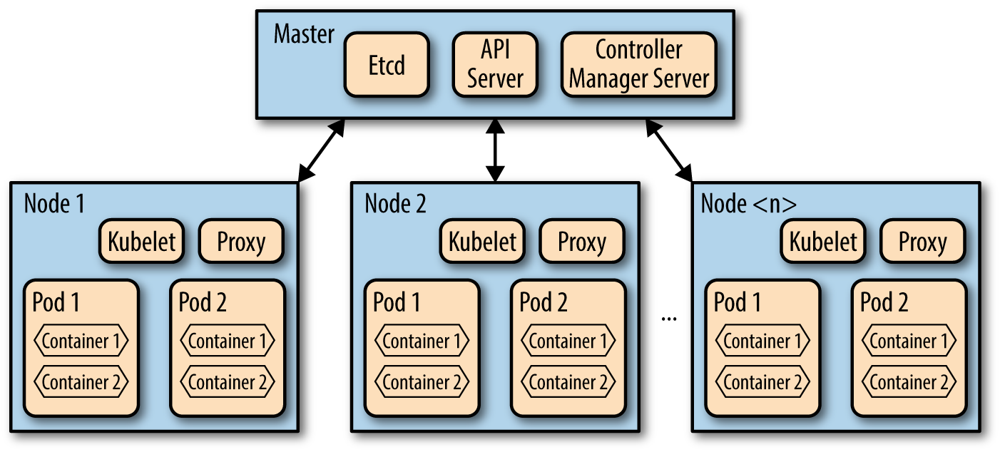

### Docker & Kubernetes

#### Concepts
* Container: a standard unit of software that packages up code and all its dependencies.
* Compared to VM: containers virtualize the operating system instead of hardware.
* Google **Borg** schedules and launches approximately 7,000 containers a second on any given day.
* After Borg was open-sourced, it becomes **Kubernetes**,
* A Kubernetes cluster does not manage a fleet of applications. It manages a cluster of services.

#### Service
A service is a process that:
* is designed to do a small number of things (often just one).
* has no user interface and is invoked solely via some kind of API.

