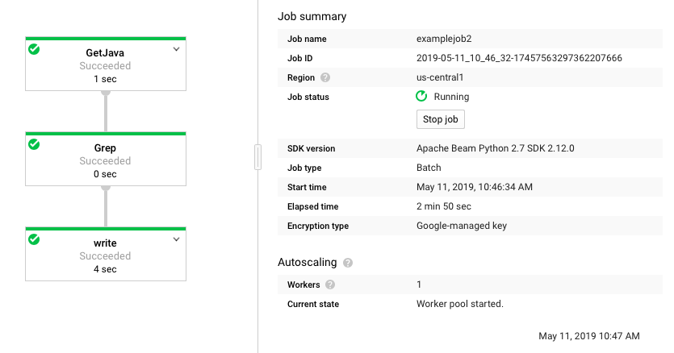

### A Simple Dataflow Pipeline
#### Objective
* Setup a Python Dataflow project using Apache Beam
* Write a simple pipeline in Python
* Execute the query on the local machine
* Execute the query on the cloud

#### Notes
* Create a bucket. Clone repo on Cloud Shell.
* Enable Dataflow API at ` Navigation menu > APIs & Services > Dashboard > Dataflow API`.
* Install dependency:

```bash
#!/bin/bash
apt-get install python-pip
pip install apache-beam[gcp] oauth2client==3.0.0
pip install -U pip
```

* Search all lines that import stuff.
* Outputs are stored in the `tmp` folder, with prefix `output-` (may be sharded).

#### Local Execution
* Study the `grep.py` [file](https://github.com/shawlu95/training-data-analyst/blob/master/courses/data_analysis/lab2/python/grep.py).

```Python
import apache_beam as beam
import sys
def my_grep(line, term):
   if line.startswith(term):
      yield line
if __name__ == '__main__':
   p = beam.Pipeline(argv=sys.argv)
   input = '../javahelp/src/main/java/com/google/cloud/training/dataanalyst/javahelp/*.java'
   output_prefix = '/tmp/output'
   searchTerm = 'import'
   # find all lines that contain the searchTerm
   (p
      | 'GetJava' >> beam.io.ReadFromText(input)
      | 'Grep' >> beam.FlatMap(lambda line: my_grep(line, searchTerm) )
      | 'write' >> beam.io.WriteToText(output_prefix)
   )

```

* Execute in CLI.

```bash
cd ~/training-data-analyst/courses/data_analysis/lab2/python
python grep.py
ls -al /tmp
cat /tmp/output-* # cat all sharded outputs
```

#### Cloud Execution
* Copy files to cloud storage.

```bash
gsutil cp ../javahelp/src/main/java/com/google/cloud/training/dataanalyst/javahelp/*.java gs://$BUCKET/javahelp
```

* Execute the `grepc.py` [file](https://github.com/shawlu95/training-data-analyst/blob/master/courses/data_analysis/lab2/python/grepc.py)

```Python
import apache_beam as beam

def my_grep(line, term):
   if line.startswith(term):
      yield line

PROJECT='qwiklabs-gcp-e086a397e19116f3'
BUCKET='qwiklabs-gcp-e086a397e19116f3'

def run():
   argv = [
      '--project={0}'.format(PROJECT),
      '--job_name=examplejob2',
      '--save_main_session',
      '--staging_location=gs://{0}/staging/'.format(BUCKET),
      '--temp_location=gs://{0}/staging/'.format(BUCKET),
      '--runner=DataflowRunner'
   ]

   p = beam.Pipeline(argv=argv)
   input = 'gs://{0}/javahelp/*.java'.format(BUCKET)
   output_prefix = 'gs://{0}/javahelp/output'.format(BUCKET)
   searchTerm = 'import'

   # find all lines that contain the searchTerm
   (p
      | 'GetJava' >> beam.io.ReadFromText(input)
      | 'Grep' >> beam.FlatMap(lambda line: my_grep(line, searchTerm) )
      | 'write' >> beam.io.WriteToText(output_prefix)
   )

   p.run()

if __name__ == '__main__':
   run()
```


* Execute in CLI.
```bash
python grep.py
```

* Outputs are saved in Cloud Storage bucket.


