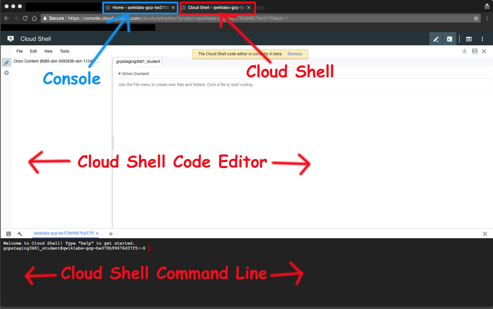

### Loading and Exporting Data

#### Objective
Load data in different formats into BigQuery tables. You will load data into BigQuery in multiple ways, transform the data that you load, and query the data.

* Load a CSV file into a BigQuery table using the web UI
* Load a JSON file into a BigQuery table using the CLI
* Export a table using the web UI



#### Notes on Import
* When uploading CSV file through console, remember to skip header row.
* Load multiple JSON files from Cloud Storage into a (newly created) `flights_2014` table in the `cpb101_flight_data` dataset.

```bash
bq load --source_format=NEWLINE_DELIMITED_JSON $DEVSHELL_PROJECT_ID:cpb101_flight_data.flights_2014 gs://cloud-training/CPB200/BQ/lab4/domestic_2014_flights_*.json ./schema_flight_performance.json
```

#### Notes on Export
* Create a bucket (with same project ID as name, in the same region) to receive the export.
* On console: select table, click `Export` and select `Export to GCS`
* On Command Line:

```bash
bq extract cpb101_flight_data.AIRPORTS gs://$BUCKET/bq/airports2.csv
```
