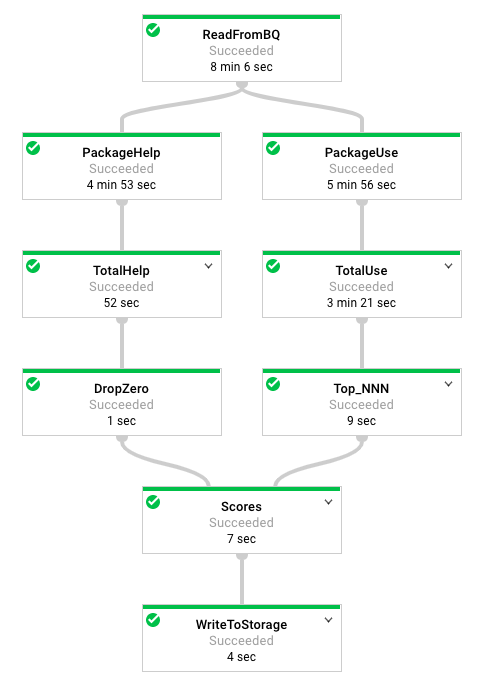

### Side Inputs
#### Objective
* Use BigQuery as a data source into Dataflow.
* Use the results of a pipeline as a side input to another pipeline.

#### Note
* Clone git repo.
* Create storage bucket.
* Enable Dataflow API.
* Install Apache Beam `sudo ./install_packages.sh`.
* Source data is from a public dataset `fh-bigquery.github_extracts.contents_java_2016`.

#### Code Study
JavaProjectsThatNeedHelp.py ([file](https://github.com/shawlu95/training-data-analyst/blob/master/courses/data_analysis/lab2/python/JavaProjectsThatNeedHelp.py))



#### Execute Task
Local execution. Monitor results in `Storage > Browser`.
```bash
python JavaProjectsThatNeedHelp.py --bucket $BUCKET --project $DEVSHELL_PROJECT_ID --DirectRunner
```

Cloud execution. Monitor progress in `DataFlow`

Output (first 5 lines):
```
(u'org', 40.24833889995975)
(u'java', 18.921605694253696)
(u'com', 41.60574836185965)
(u'org.apache', 14.39932667637452)
(u'net', 25.523469642180004)
```
