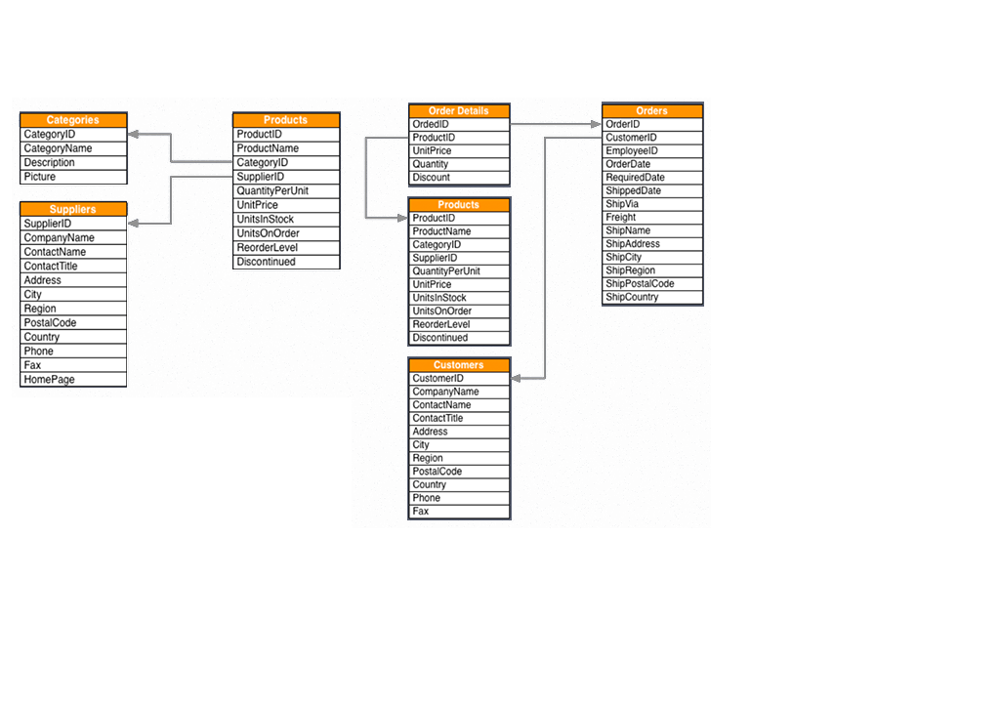

#### Load Table
```Java
LOAD CSV WITH HEADERS FROM "http://data.neo4j.com/northwind/products.csv" AS row
CREATE (n:Product)
SET n = row,
  n.unitPrice = toFloat(row.unitPrice),
  n.unitsInStock = toInteger(row.unitsInStock), n.unitsOnOrder = toInteger(row.unitsOnOrder),
  n.reorderLevel = toInteger(row.reorderLevel), n.discontinued = (row.discontinued <> "0");

// Added 77 labels, created 77 nodes, set 1155 properties, completed after 1310 ms.
```

```python
LOAD CSV WITH HEADERS FROM "http://data.neo4j.com/northwind/categories.csv" AS row
CREATE (n:Category)
SET n = row;

# Added 8 labels, created 8 nodes, set 32 properties, completed after 725 ms.
```

```python
LOAD CSV WITH HEADERS FROM "http://data.neo4j.com/northwind/suppliers.csv" AS row
CREATE (n:Supplier)
SET n = row;

# Added 29 labels, created 29 nodes, set 348 properties, completed after 1489 ms.
```



```python
LOAD CSV WITH HEADERS FROM "http://data.neo4j.com/northwind/customers.csv" AS row
CREATE (n:Customer)
SET n = row;
# Added 91 labels, created 91 nodes, set 1001 properties, completed after 1064 ms.

LOAD CSV WITH HEADERS FROM "http://data.neo4j.com/northwind/orders.csv" AS row
CREATE (n:Order)
SET n = row;
# Added 830 labels, created 830 nodes, set 11620 properties, completed after 1291 ms.

LOAD CSV WITH HEADERS FROM "http://data.neo4j.com/northwind/order-details.csv" AS row
MATCH (p:Product), (o:Order)
WHERE p.productID = row.productID AND o.orderID = row.orderID
CREATE (o)-[details:ORDERS]->(p)
SET details = row,
  details.quantity = toInteger(row.quantity);
# Set 12930 properties, created 2155 relationships, completed after 1313 ms.
```

#### Add Index
```SQL
CREATE INDEX ON :Product(productID);
CREATE INDEX ON :Category(categoryID);
CREATE INDEX ON :Supplier(supplierID);

CREATE INDEX ON :Customer(customerID);
CREATE INDEX ON :Order(orderID);
```

#### Create Relationships
```SQL
MATCH (p:Product),(c:Category)
WHERE p.categoryID = c.categoryID
CREATE (p)-[:PART_OF]->(c);

MATCH (p:Product),(s:Supplier)
WHERE p.supplierID = s.supplierID
CREATE (s)-[:SUPPLIES]->(p);

MATCH (c:Customer),(o:Order)
WHERE c.customerID = o.customerID
CREATE (c)-[:PURCHASED]->(o)
-- Created 830 relationships, completed after 65 ms.
```
