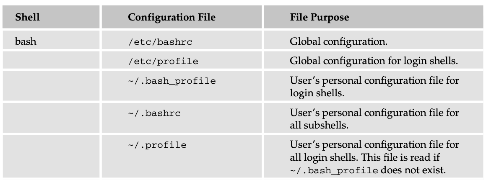

## Beginning Unix
* by Paul Love, Joe Merlino, et al.
* April 25, 2005
* [paperback](https://www.amazon.com/Beginning-Unix-Paul-Love/dp/0764579940/ref=sr_1_1?dchild=1&keywords=beginning+unix&qid=1608708651&sr=8-1)

### Anchor
* [Chapter 1 Unix Fundamental](#Chapter-1-Unix-Fundamental)
* [Chapter 2 System](#Chapter-2-System)
* [Chapter 3 Accounts and Groups](#Chapter-3-Accounts-and-Groups)
* [Chapter 4 Chapter 4 File System](#Chapter-4-File-System)
* [Chapter 5 Working Environment](#Chapter-5-Working-Environment)
* [Chapter 6 Linux Command](#Chapter-6-Linux-Command)
* [Chapter 8 Advanced Tool](#Chapter-8-Advanced-Tool)
* [Chapter 9 Sed and Awk](#Chapter-9-Sed-and-Awk)
* [Chapter 10 Process Management](#Chapter-10-Process-Management)
* [Chapter 11 Automating Process](#Chapter-11-Automating-Process)
* [Chapter 13 Shell Scr](#Chapter-13-Shell-Script)
* [Chapter 14 Advanced Scripting](#Chapter-14-Advanced-Scripting)

### Chapter 1 Unix Fundamental
Two base version:
* AT&T System V: `/usr/bin`
* Berkley Software Distribution (BSD): `/usr/ucb/bin`

Components of Unix:
* Kernel: lowest level, built for specific hardware, manages process, memory, multi-task
* shell: command line interpreter. different shells available: Bourne shell, c-shell
  - look for xterm/konsole Application in a GUI
* file system
* utilities

Concept
* paging: move part of a process to hard disk, provide virtual memory
* swap: move the least busy process entirely to hard disk
* swap space: the space on hard drive used for virtual memory
* boot process/bootstrapping: use read-only-memory to load booting program. hand control to kernel
* run level: a group of processes or daemons

___
### Chapter 2 System
* Boot
* Initialize
* Login: remote login use: ssh (entrypted), telnet, sftp (entrypted), ftp
* Logout: `exit` or `logout`
* shutdown: need proper shutdown because multi-user/multi-process operates on file system
  - recommend `shutdown`
  - reboot using `shutdown -r`
* `man` manual command:
  - `man command`
  - `man -k keyword` return list of command containing the keyword

___
### Chapter 3 Accounts and Groups
Three types of accounts:
* root account/superuser
* system accounts: each made for specific function (mail, ssh), do not modify
* user accounts: <= eight characters for interoperability
* unix permission are grouped into 3 sets: owners, groups, others
  - a user can be in many groups
* login shell: listed in `/etc/shells`
* accounts info: `cat /etc/passwd`
* password encryption and valid date: `/etc/shadow`
* group `cat /etc/group`, some variants have `gshadow` file

```bash
# /etc/passwd file
# userid:password:userid:dafault groupid:comment:home dir:login shell
beginningunix:x:510:500:Beginning Unix:/home/beginningunix:/bin/bash

# group name:password:group ID:group users
_analyticsusers:*:250:_analyticsd,_networkd,_timed,_reportmemoryexception,_mbsetupuser
```

#### Account management
Manage account must log in as root
```bash
useradd # modify passwd, shadow, group file, create directory
usermod # same argument as useradd, use -l to change account name
userdel
groupadd -g group_id group_name # edit /etc/group file
groupmod -n new_modified_group_name old_group_name -g group_id
groupdel group_name # doesn't delete file

# create account
useradd -c comment -d home directory -e expiration date -f inactive days -g primary (default) group -G secondary groups -m -s shell -u user id accountname

# set passsword
passwd accountname

# switch user
su username

# switch and use the other user's env profile
su - username
```

* The `sudo` (superuser do) command enables the superuser, or root administrator, to delegate commands that can be run by others.
```bash
sudo -l # list available command
su # switch to superuser
who # who are currently login
whoami # who currently logged in
who am i # who originally logged in as
id # sho info about current user
groups
groups shawlu
```

___
### Chapter 4 File System
* Everything in unix is considered to be a file
* Unix is **case-sensitive**; windows and mac OS are case insensitive
* `/`: root
* `bin`: binary executables critical for system use `/bin/passwd`
* `boot`: for booting the system
* `dev`/`device`
* `etc`: system configuration files for example `/etc/passwd`
* `export`: contain remote file system
* `home`: users and accounts
* `kernel`
* `lib`: library files and other kernel-related file
* `mnt`: used to mount other temporary file system
* `proc`: processes
* `sbin`: binary executable for system administration
* `tmp`: temporary files between system boot
* `usr`: many purposes
* `var`: variable lenth files such as log, can be very small or very large

Common command
* `pwd`: print working directory
* `cd`: change directory, `cd ~` change to home directory
* `which`: location of command being used (highest precedent)
* `whereis`: locations of all command instances
* `find`: cost a lot of resources, e.g. `find /usr/share -name lostfile -print`
* `file`: what type of file, e.g. `file`
* `ls`: list, show extended info: `ls -l`, show hidden `ls -a`
  - `-` regular file
  - `b` block special file
  - `c` character special file
  - `d` directory
  - `l` symbolic link
  - `p` named pipe
  - `s` socket  

* Inode: unique identifier of a file in a partition
  - files in different partitions can have different inodes
* soft link: point to the path of the linked file: `ln -s original_file soft_link`
* hard link: point to the inode of the linked file: `ln original_file hard_link`
  - rename linked file: soft link breaks, hard link works
  - replace file with same name: soft link works, hard link breaks
* `chmod`: `o` for others, `u` for user, `g` for groups, `+/-` add/remove privilege
* symbolic mode: rwxrwxrwx
* absolute permission: read=4, write=2, execute=1
| Permission     | Directory                         | File            |
| :------------- | :-------------                    | :-------------  |
| Read           | Read content                      | View file       |
| Write          | Create, modify, remove file/subdir| Edit or delete  |
| Execute        | Enter directory                   | Run the program |

File System Management
* `cat`: dump entire content
* `more`/`less`: paging, allow navigation
* `head`/`tail`: show beginning/end of file
  - `tail -f file`: follow end of file, useful for real-time log streaming
* `cp`: copy file, need read source file, write destination directory
* `mv`: move file
* create empty file: `touch filename`
* `rm` remove
  - `-r` recursive
  - `-f` force, no asking
* `mkdir`
* `rmdir` remove completely empty directory
* `df` disk free, `df -k` measure in kilobyte, `df -h` for human readable
* `du` specify a directory: `du -h dir`
* `fsck`: file system check, repair inconsistency
* `mount`: pass no arg to see current mounted file systems
* `unmount`
* current dir: `.`
* parent dir: `..`
* user home dir: `~`

___
### Chapter 5 Working Environment
Shell allows users to interact with kernel
* Bourne shell
* Ash shell
* Bourne Again shell (Bash)
* Korn shell
* C shell
* Z shell
* Perl shell

Display all env variables: `set`

display working directory in the prompt
`PS1="[\u@\h \w]\$"`



#### PATH variable
* specify a list of directories which might contain the executables (order matters)
* The value of the PATH variable is usually set at the system-wide level in a configuration file such as /etc/profile.

```bash
# example appending directory
PATH=$PATH:/home/joe:/home/joe/myprog:/home/joe/myprog/bin

/opt/anaconda3/bin:/opt/anaconda3/condabin:/Library/Frameworks/Python.framework/Versions/3.6/bin:/Library/Frameworks/Python.framework/Versions/2.7/bin:/usr/local/Cellar/hbase/1.3.5/libexec/bin:/Applications/MAMP/Library/bin:/usr/local/bin:/usr/bin:/bin:/usr/sbin:/sbin:/Users/shawlu/Documents/apache-maven-3.6.3/bin:/Library/TeX/texbin:/opt/X11/bin:/Library/Apple/usr/bin:/opt/gradle/gradle-6.5.1/bin:/usr/local/mysql/bin:/Library/Java/JavaVirtualMachines/jdk1.8.0_231.jdk/Contents/Home/bin:/opt/apache-maven/bin:/Users/shawlu/Documents/hadoop-2.7.3/sbin:/Users/shawlu/Documents/hadoop-2.7.3/bin:/Users/shawlu/Documents/hadoop-2.7.3/apache-hive-3.1.2-bin/bin:/Users/shawlu/Documents/apache-zookeeper-3.5.5-bin/bin
```

#### Create aliases
* Alias only applicable in current shell session
* To make permanent, add the alias to `~/.bash_profile`

```bash
alias dl="clear && cd ~/Downloads"
alias dt="clear && cd ~/Desktop"
alias dc="clear && cd ~/Documents"
```

___
### Chapter 6 Linux Command
Components of a cmmand:
* prompt
* target
* option
* flag
* switch

Wildcard
* `*` substitute any character
* `?` substitute one character
* `[]` matches ONE character in the bracket

Redirection
* `>` direct output, overwrite existing
* `>>` direct output, append to existing
* `<` direct input
```
sort < terms > terms-alpha
```

Pipe
* Use `|` to chain command
* Output of one command is input to the next: `pwd | ls`

Command Substitution
* `ls $(pwd)`: execute `pwd` in a subshell
* `ls ${pwd}`: execute `pwd` in same shell
```
ls `pwd`
```

Command `ls`:
* `-a` all file
* `-l` long format
* `-t` sort by timestamp
* `-i` include inode
* `-R` recursive

Command `more/less`
* `more` can only scroll forward
* `less` can scroll back (press `B`)
* press `Q` to quit

Command `touch`
* update timestamp on a file
* create if not exists

Command `unmask`
* set default permission of files when first created
* specify what permission to deny: `unmask 022` is opposite of `644`
* place `unmask` in `./profile` to persist through all shells

___
### Chapter 8 Advanced Tool
### Meta-character
* Do not confuse with wildcard
* `.` represent any one character/number
* `[]` for example `c[aeiou]t` will match `cat` `cut`
* `*` match *zero* or one or more character
* `[^]`: Do not match any of the characters following the caret.
* `^`: Match the sequence only if it is at the beginning of the line.
* `^[]`: Match any one character inside brackets; match sequence at the beginning of the line.
* `$`: match end of line only: `c*t$` with zero of any character in between
* `?` zero or one character (different from `*`)
* `[a-z]`: full set of lowercase, match one
* `[0-9]`

Command `grep`
* global regular expression print
* `grep string_to_search_for file_to_search`
* can use to filter output of other command: `cat /etc/passwd | grep root`

Command `find`
* find files in directory

```
find /etc –name passwd
find /Users/shawlu/Movies -user shawlu -size +2000000k -print
```

Command `sort`
* `sort -d /tmp/outoforder`
* `-u` return unique only
* `-r` print in reverse order

Command `tee`
* print output to stdout
* also direct output to another file for later review
```
ps -ef | tee -a /tmp/troubleshooting_file
```

Command `script`
* log every keyboard stroke
```
script -a /tmp/script_session
exit
```

Command `wc`
* word count
* `-c` count character
* `-l` count line
* `-w` count word
```bash
wc -w /tmp/testfile
```

___
### Chapter 9 Sed and Awk
#### Sed
* stream editor

```bash
# multiple edit command
sed -e 's/Paul/Pablo/; s/Pat/Patricia/' names1.txt names2.txt
sed -e 's/Paul/Pablo/g' -e 's/Pat/Patricia/g' names1.txt names2.txt

# submit a file containing edit command
sed -f edits.sedscr names1.txt names2.txt > names3.txt
```

#### Awk
* AWK, unlike sed, is actually a full-fledged, structured, interpreted programming language for pattern matching.
* AWK is typeless
* AWK is stateless
* contains two parts: pattern and command
* pattern is used to filter content
* command applies only when pattern evaluates as true
* BEGIN and END block are optional, used for setup and cleanup job
* Default variables:
  - `NF`: number of words of current line  
  - `NR`: current line number
  - `FILENAME`:
  - `RS`: separator

```bash
# $0 is the entire line
awk '{ print $0 }' /etc/passwd

# specify delimitor :
awk -F":" '{ print "username: " $1 "\t\t\t user id:" $3 }' /etc/passwd
```

___
### Chapter 10 Process Management
* A process is an instance of a running program
* each process as a process ID `PID`
* `init` is first process of system boot, ahd has PID=1
* PID is assigned sequentially, but system might randomly assign to avoid race condition
* The shell has PID assigned to `$` variable: `echo $$`
* use `file` to see if a file is executable
* Use sh-bang `#!` to tell kernel to run the program
* check process status: `ps`
* check process state `ps u` or `ps -l`

```bash
#!/bin/cat
Hello World
```

```bash
# count running process
ps ax | wc -l
```

#### System Process
* Normally, system processes do not have a TTY (teletype) in use (use `ps ax`)
* Display processes with attributes: `ps -o user,pid,ppid,vsz,comm`

#### Kill Command
* Send a signal to process
* List all signal: `kill -l`
* Try not to use force kill: `kill -9`, or `SIGKILL`
* To find the PID of a process, pipe through `grep`: `ps auxww | grep firefox`

```
Some of the more commonly used signals:
1       HUP (hang up)
2       INT (interrupt)
3       QUIT (quit)
6       ABRT (abort)
9       KILL (non-catchable, non-ignorable kill)
14      ALRM (alarm clock)
15      TERM (software termination signal)
```

#### Top Command
* Display active processes sorted by various criteria
* display uptime: `uptime`
  - The load average shows the average number of jobs in the run queue for the past minute, 5 minutes, and 15 minutes.

* show running jobs: `jobs`
* Use `&` to run a process in background
* sleep for 60s: `sleep 60 &`, make it run in background
* bring background process to foreground: `fg`
  - take a number as argument - number of processes
* suspend by sending signal 18 `SIGTSTP`, then unsuspend by signal 19 `SIGCONT`

```bash
sleep 120 &
kill -18 %2
kill -19 %2
jobs
```

___
### Chapter 11 Automating Process
* hardware clock is battery powered
* hardware clock tracks universal time (UTC) aka Greenwich Mean Time (GMT)
* keep clock in sync with other system: network time protocol (NTP)
  - `sudo ntpdate`
  - NTP uses a trust level to determine what server has an authoritative time
#### Schedule program

#### Cron
* `cron`: requires cron daemon `crond`, start the daemon in background: `sudo crond`
* check cron is running: `ps auwx | grep cron`
* crontab schedule: minute 0-59, hour 0-23, day of month 1-31, month 1-12, day of week 0-7 (0 and 7 mean Sunday)
  - if either day of month or day of week is matched, job will execute
  - step size: `/4`
  - provide a range: `12-16`
  - specify range and step: `12-16/2`
  - send output: `| mail -s “Backup Script Output” username`, `>> log.file`
  - give or deny access crontab by writing username in `/etc/cron.deny`, `/etc/cron.allow`
* crontab is the configuration file for the cron daemon.

```bash
# each user should have his own crontab file
crontab -l
crontab -e
crontab -r # remove user's crontab

# main crontab
/etc/crontab
```

#### At
* `at` is for one-time execution
* open an `at` shell `at 17:00` then enter command
* see scheduled command: `atq`
* remove a command: `atrm + id`
* date is format 010105 MMDDYY
* can also submit a file
* control access: `/etc/at.allow` or `/etc/at.deny`
```
$ at 17:45 $ at 5pm
$ at 5:15pm $ at noon
$ at teatime
$ at teatime 010105
$ at now + 5 minutes
$ at now + 2 hours
$ at 4pm + 3 days
$ at 1 week
$ at 17:00 -f ~jdoe/bin/backup
```

___
### Chapter 13 Shell Script
* variable are interpreted as string, can't do arithmatic. Must use `expr`

```bash
MYVAR=1
MYVAR=`expr $MYVAR+1`
print $MYVAR
```

* can extract a variable in string:

```bash
PERSON=”Fred”
echo “Hello, $PERSON”
```

* read input from keyboard
```bash
echo "What is your name?"
read PERSON
echo "Hello, $PERSON"
```

#### Special Variables
* `?`: exit status: 0 success, 1 fail
* `$` PID of current shell
* `-`: Options invoked at start-up of the current shell.
* `!`: The PID of the last command that was run in the background.
* `0`: The filename of the current script.
* combine conditions: `if [ condition1 && condition2 ]`
* or condition: `if [ condition1 || condition2 ]`

```bash
# conditional
if some_condition
then
  something happens
elif [ $COLOR != “purple” ]
  something happens
else
  something happens
fi
```

#### Case Statement
* ending with `esac`
* each condition ends with `;;`

```bash
case expression in pattern1)
  action1
;;
pattern2)
action2
;;
pattern3)
action3
;;
esac
```

#### Test Command
* same as if followed by square bracket: `if ( test $COLOR=”purple” )`
* test if a file exists: `if ( test -e filename )` or `if [ -e filename ]`

#### Iterative
```bash
read COLOR
while [ $COLOR != "purple" ] do
  echo "Incorrect. Guess again. \n"
  read $COLOR
done
echo “Correct.”


# until
read COLOR
until [ $COLOR = "purple" ] do
echo "Incorrect. Guess again. \n"
read $COLOR done
echo "Correct."
```

___
### Chapter 14 Advanced Scripting
* using backtick to assign output of command to variable:
```bash
Lines=`wc -l textFile`
```
* Use double quotation to "expand content":

```bash
Lines="$(wc -l textFile)"

# nesting is supported
echo "Next year will be 20$(expr $(date +%y) + 1)."
```

* environment variable: accessible to all child shells and sub-processes
* export env var: `export name=value`
* display all env var: `set`

#### Function
* do not define parameter name in bracket; params are $1, $2 etc
* `return` a value from function
* function must be defined before referenced

```bash
# define function
repeat() {
  echo -n "I don’t know $1 $2"
}

# calling function
repeat Shaw Lu
```

#### Scope
* variable is declared global by default
* use `local` to declare local variable

#### Function Library
* place lib file in `~/lib/`
* use dot to import script: `. ~/lib/scope`
* lib file doesn't need to be executable. textfile would work

#### getopts
* a commandline argument parser
* format `getopts opstring name`
* if a parameter needs an argument, it's followed by `:`
* `name` contained the parameter that required an argument
* `OPTIND` — Stores the index of the next argument to be processed.
* `OPTARG` — If an argument is required, it is placed in here by getopts.

```bash
while getopts “xy:z:” name
do
  echo "$name" $OPTIND $OPTARG
done

# call the script
# ~/bin/get.sh -xy “one” -z “two”
# print
# x 1
# y 3 one
# z 5 two
```

#### Signal
* Get a list of signal: `trap -l`
* interrupt: `CTL + C`
* quit: `CTL + D`
* `SIGKILL`/9: quit immediately, no cleanup
* check if file exists and writable
```bash
# available options for testing
# -d exists and is directory
# -e exists
# -r readable
# -s exists and size > 0
# -w exists and writable
# -x exists and executable
if [ -w writeFile ]
then
  echo "writeFile exists and is writable!"
fi
```

* Example file accepting signal and cleanup file before quit

```bash
#!/bin/bash
# sigtrap
# A small script to demonstrate signal trapping

# create a tmp file named after PID
tmpFile=/tmp/sigtrap$$

# await keyboard input to write to tmp file
cat > $tmpFile

function removeTemp() {
  if [ -f “$tmpFile” ]
  then
    echo “Sorting out the temp file... “
    rm -f “$tmpFile”
  fi
}

# if receive signal 1 or 2, call removeTmp
trap removeTemp 1 2
exit 0
```

#### Array

```bash
# declare array
array1[index]=value
array2=(value1 value2 value3 value4)

# index does not need to be in order
array3=([0]=value1 [13]=value2 [7]=value3)

# de-reference array
${array[index]}
value=${array3[13]}

# return all elements
arrayelements=${array2[@]}

# find array length
arraylength=${#array2[@]}

# return a subarray
${array[@]:3} # from the fourth (inclusive) to the last
${array[@]:3:2} # return fourth (inclusive) and fifth

# remove second element
unset array[1]

# remove all
unset array[@]

# read array from txt file
# tr replaces newline with white space
# string in back ticket must return a space-separated list
populated=(`cat ~/tmp/sports.txt | tr '\n' ' '`)
```

#### Security
* shell script is not designed for security, it's designed to simplify things
* create a subdir in `/tmp` to work on your own stuff
* do not give everyone write permission
* give just enough permission to do its job and nothing more
* user **restricted** shell

#### System Administration
```bash
# common tasks
df
du
lastlog
lsdev
lsof
ps
stat
top
vmstat
w
```

#### Debugging
* check syntax error of a script: `sh -n scriptname` or `sh -vn scriptname` with verbose outcome
* print each command: `sh -x scriptname`
  - for larger script, mark where to print with `set -x` and where to stop with `set +x`
